# FreeFido

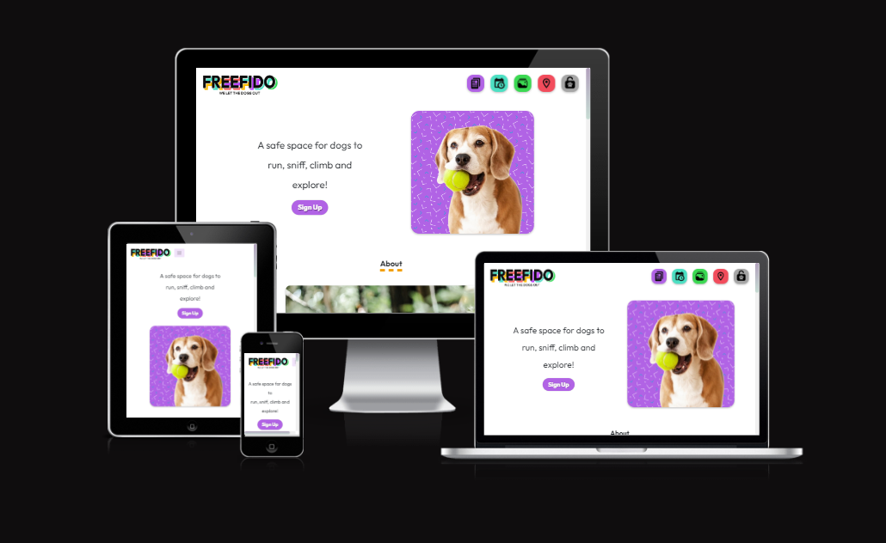

## Introduction

FreeFido is a social media and booking app for a private dog park. FreeFido has been developed as part of the Code Institute's Full-Stack Developer course as my 4th project - focusing on Django and Bootstrap frameworks, Database manipulation and CRUD functionality. It is for educational purposes only.

View live site here : [FreeFido](https://freefido.herokuapp.com/)

## Table of Contents

- [FreeFido](#freefido)
  - [Introduction](#introduction)
  - [Table of Contents](#table-of-contents)
  - [Overview](#overview)
- [UX - User Experience](#ux---user-experience)
  - [Design Inspiration](#design-inspiration)
    - [Colour Scheme](#colour-scheme)
    - [Font](#font)
  - [Strategy Plane](#strategy-plane)
    - [Site Goals](#site-goals)
    - [Agile Methodologies](#agile-methodologies)
  - [User Stories](#user-stories)
    - [Visitor User Stories](#visitor-user-stories)
    - [Epic - User Profile](#epic---user-profile)
    - [Epic - Articles](#epic---articles)
    - [Epic - Booking](#epic---booking)
    - [Epic - Photo Gallery](#epic---photo-gallery)
    - [Epic - Visit Us/Reviews](#epic---visit-usreviews)
  - [Scope Plane](#scope-plane)
  - [Structural Plane](#structural-plane)
  - [Skeleton Plane](#skeleton-plane)
    - [Wireframes](#wireframes)
    - [Database Schema](#database-schema)
    - [Security](#security)
  - [Features](#features)
  - [Features](#features-1)
  - [Future Features](#future-features)
  - [Technologies Used](#technologies-used)
    - [Languages Used](#languages-used)
    - [Libraries \& Frameworks](#libraries--frameworks)
    - [Tools \& Programs](#tools--programs)
  - [Testing](#testing)
  - [Deployment](#deployment)
    - [Heroku deployment](#heroku-deployment)
    - [Cloudinary API](#cloudinary-api)
    - [Clone project](#clone-project)
    - [Fork Project](#fork-project)
  - [Credits](#credits)
    - [Code](#code)
    - [Media](#media)
    - [Additional reading/tutorials/books/blogs](#additional-readingtutorialsbooksblogs)
  - [Acknowledgements](#acknowledgements)

## Overview

FreeFido is an social media and booking app for a private dog park. Users are invited to:

- Join the Freefido community
- Create their own profiles
- Add and interact with articles
- Create and manage their bookings
- Upload their favourite snaps from the park
- Discover more about the dog park

FreeFido is accessible via all browsers with full responsiveness on different screen sizes. Its aim is to create a safe, informed community of dog owners who can interact and share with each other and avail of the essential booking feature to reserve a spot in the secure, private dog park. I have created this site to meet the needs of the growing private dog park business. Private dog parks have become a highly sought after service for dog owners to exercise and train their dogs in a safe, secure area, without the fear of a strange dog running up to them. Dog reactivity is unfortunately on the rise at public dog parks due to some dog owners being unaware of dog body language and basic etiquette. FreeFido aims to offer a starting point for creating a community of regular users of this dog park who can book one hour slots through the basic booking system. In future development of this project, I hope to offer users an upgraded booking system with payment options, the opportunity to connect with other parks users with compatible dogs via adding a friend and direct messaging, hire a trainer and purchase merchandise and training equipment.

# UX - User Experience

## Design Inspiration

I was really excited to get working on this project's frontend as I could see the final product from the very beginning. I wanted to create a website that had plenty of clean whitespace that allowed colourful, bright icons to pop for each section of the website. The colours chosen were very specific from the beginning and I was careful to manipulate the CSS for each section to carry the relevant, related colour through. Original inspiration was from the Fisher-Price toy games controller, I had wanted to create an interactive, service-based website, with it's own logo using the colour scheme of the games controller. Once I had chosen the font of 'Outfit' and created the logo on Procreate, the website content followed swiftly and I had great fun developing it.

  

*Original inspiration for the design process*

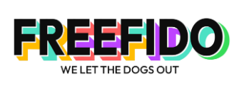  

*FreeFido logo in font 'Outfit' using colours inspired by the toy*

### Colour Scheme

As mentioned above, the colour scheme and logo drove the design of the website. I wanted to create a 'fun' environment for the user to create the connection with the enjoyment that they would have with their dog at the park. The colours represent different sections/features of the website. I balanced the vibrant shades with a classic, #fff white background and an off-black shade of #0d0d0d, as I felt that it yielded a slightly more matte effect that #000 black. This combination also yielded a high contrast ratio of 19.44 for accessibility, with my colour scheme also passing a Colour Blind Safe check via [Adobe Color](https://color.adobe.com/create/color-wheel). This check was important for accessibility as the colours would form the base for my page and feature icons. Each colour in the scheme was also contrast checked with black #0d0d0d to ensure no contrast issue, all passed.

The corresponding sections and colours are:

- Authentication: #AC44F2
- Gallery: #3BD952
- User Profile: #F29F05
- Visiting Information: #F25C5C
- Booking: #4CE0C3

For the Login/Logout icon, a grey #a6a6a6 was used as a base colour. I felt this grey helped to balance the colours and prevent the icons from 'popping' too much for the eye in the navigation bar.

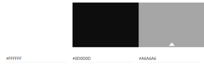  

*Black, white and grey used for backgrounds, text and Login/Logout icon*

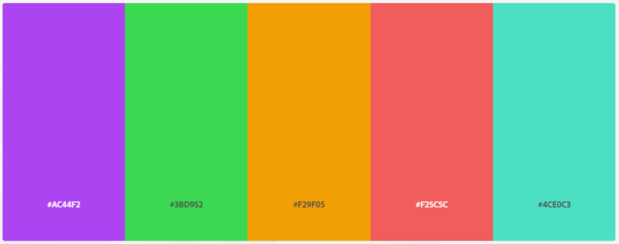

*Colour Scheme for FreeFido website*

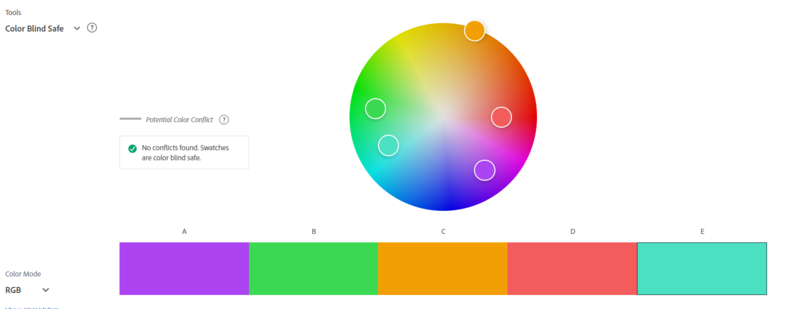

*Accessibility check for colour scheme*

### Font

Using [Google Fonts](https://fonts.google.com/), I imported 'Outfit' and 'Montserrat' as a complementary font to my CSS file. Outfit is a playful, clear sans-serif which I felt worked well in designing my logo and for headers in my project. For future use, I envisoned merchandise bearing the logo for the FreeFido stall at the dog park. Montserrat was chosen as it gave more structure to the paragraph sections.

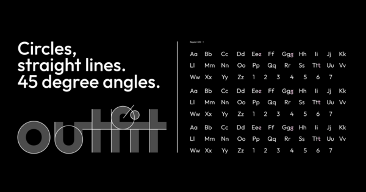

*Outfit, a Google Font designed by Rodrigo Fuenzalida*

## Strategy Plane

The project goal was to build a simple booking app for a service. The 'product' was a one hour slot in a private, secure dog park and the 'user' was dog owners, trainers and walkers. As the service itself was uncomplicated, I aimed to create an easy, uncomplicated booking system for the user. Through planning and design prep work, I realised that there was an opportunity to treat this service like a 'brand' and develop the idea further. A social element was born from this with an idea for dog owners to be able to share advice and images of their furry friends on the website. This would hopefully help to create a happy group of park users who would recommend the park to others, share articles outside of the core group, and attract more users to sign up. Following common social-media design trends, I planned to use icons, high-quality, photographic images and an attractive, connected colour scheme.

### Site Goals

- Create a safe, happy environment for dog owners
- Use of playful colour to identify connected features of the website, plenty of white space to keep it fresh and to-the-point
- Commononly used, identifiable icons with some redesigns to fit the theme
- Easy UI for quick fulfillment of feature CRUD functionalities
- UX remains the same whther on mobile, tablet or desktop
- Scalable idea, for addition of future features to easily grow the business

### Agile Methodologies

## User Stories

User stories and features recorded and managed on GitHub Projects -> (<https://github.com/users/amylour/projects/4>)

### Visitor User Stories

  - As a user, I would like to view the websites home page so that I can learn about it and the services it offers.
  - As a user, I can find the websites navigation area so that I may easily navigate around the website.
  - As a user, I can see the sites social media links at the bottom of the webpage so that I can visit, contact the business and follow them online.
  - As a user, I can view any error pages with a 'Home' button so that I can get back to the homepage easily.

### Epic - User Profile
    
  - As a user, I can use my email and password to login to my profile account so that I can use my profile to connect to the websites features.
  - As a user, I can enter my email and password so that I can register an account with the website.
  - As a user, I can enter my personal details so that I can create an account with FreeFido.
  - As a user, I can receive feedback in the form of a logout page so that I can confirm that I have been logged out successfully.
  - As a user, I can edit my user profile to update my personal details.
  - As a user, I can click a delete button in my user profile setup so that I can delete all personal data, photos and bookings that are connected to me on the website.

### Epic - Articles

  - As a user, I want to be able to create and view articles so that I can learn more about dog related topics.
  - As a user, I would like to move to the next page so that I can view all of the articles.
  - As a user, I would like to view an article's likes so that I can find the most interesting articles.
  - As a user, I can visit the articles page so that I can read and interact with the articles.
  - As a user, I can click on an article so that I can view it's contents.
  - As a user, I can click a button icon so that I can like/unlike and article.
  - As a user, I can comment on a post so that I can interact and get involved with the conversation.
  - As a user, I can fill-in, edit and save an article text field so that I can create and share an article from my profile.
  - As a user, I can click on the edit button of my article so that I can edit the article and save it again.
  - As a user, I can click on the delete button on my own article page so that I can delete the article.
  - As a user, I can enter a search term into the search bar so that I can search for particular articles and articles with information topics that I am interested in.
  - As a user, I can click a delete button so that I can remove a comment that I have made.
  
### Epic - Booking

  - As a user, I can view the booking home page so that I can learn about booking and see my active bookings.
  - As a user, I can use the bookings page so that I can make a booking at the dog park.
  - As a user, I can receive feedback via email when I make a booking so that I can confirm my booking and keep a copy of it in my email account.
  - As a user, I can edit my confirmed bookings so that I can choose a different day or time slot or add an extra dog.
  - As a user, I can click the 'Trash' icon under my booking so that I can delete that booking from my bookings list.

### Epic - Photo Gallery

  - As a user, I can visit the gallery page so that I can view the gallery wall of photos.
  - As a user, I can click the upload image button on the Gallery page so that I can upload an image of my dog have fun in the park.
  - As a user, I can click the trash can icon when I hover/click on a photo so that I can delete the photo.

### Epic - Visit Us/Reviews

  - As a user, I can view the 'Visit Us' page so that I can see the businesses location and details.
  - As a user, I can get feedback from the website that will explain that only four active bookings are allowed per person.
  - As a user, I can fill out a review form so that I can leave feedback about my park visit.
  - As a user, I can edit my review so that I can correct a mistake or change my review.
  - As a user, I can click the delete button beside my review so that I can delete a review that I made.
    
    
## Scope Plane

As this would be a dual learning/building project using technologies that were new to me, such as Django, SQL, Bootstrap and Cloudinary, I was cautious to maintain consistent control over the scope of the project and not let my idea grow too big. With the sheer amount of files, I needed to lockdown my project features early on into manageable blocks so as not to lose track of the MVP. Following my learning of the Django MVC framework I was able to identify how to change the templated structure to produce different website features from my base HTML. This allowed me to build upon my original idea of 'Booking app' only, and to add a social experience around articles and shared images. Following Agile Planning Methodologies, I added my Developer Tasks, User Stories and Testing Tasks as issues on my [GitHub project board](https://github.com/users/amylour/projects/4), and set up Sprints to keep the flow of the project in check.

Essential features of my project were:

- A striking, accessible website that fulfils user needs
- Responsive website for users of mobile, tablet and desktop devices
- User authentication
- User Profile creation and editing
- Article feature with full CRUD functionality
- Booking feature with full CRUD functionality
- Gallery wall with adding/deletion of images
- Business details to inform the user

Planning my project thoroughly from the start allowed me to identify areas of importance for MVP completion and satisfaction of assessment criteria, and to balance them with the feasibility of the features.

## Structural Plane

From initial concept to finished product, icons as the navigation area was an idea that I stuck with. I wanted to understand how to implement icon-based UX successfully so that the user can easily understand its purpose. Combining icons from Google's [Material Symbols & Icons](https://fonts.google.com/icons?icon.set=Material+Icons) pack, icons from Flaticon and my colour scheme, I created my navbar icons. I edited my Login/Logout icons with a pawprint to have them fit the theme better.

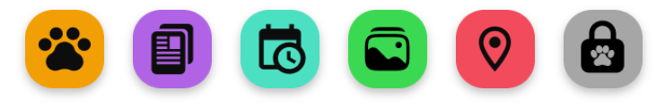  

*Navigation icons for FreeFido*

Accessibility is very important to me and in case I missed the mark with my icon idea, I ensured that I created tooltips for both mobile and desktop views that reveal the icons purposes on hover with the mouse and hover/light touch on mobile.

  
  
*Navigation bar tooltips demonstrated on Desktop*

## Skeleton Plane

### Wireframes

The wireframes for FreeFido were created in Figma and were high-spec from the beginning as I was sure of my design concept. Figma is an easy and fast design system for web and software mockups that allows for great control and testing of ideas particularly within the specific frame sizes which represent different devices. As I was using Bootstrap, I was confident that I had created a modular structure for my feature elements that would suit a grid system and that would allow them to easily work across different devices and screen sizes. 

Mobile/Tablet view for:

- Home
- Sign Up
- Profile

Originally I had planned for the home page to be mostly icon based for quick and easy use. However, I felt that this format would suit a downloadable app version of FreeFido, instead of the web version, which regular users might avail of to give them quicker access to the booking page, especially if they are one-handed, walking the dog on the way to the park. This will be part of my future features for the project growth.

    
Mobile/Tablet Home Page
  
    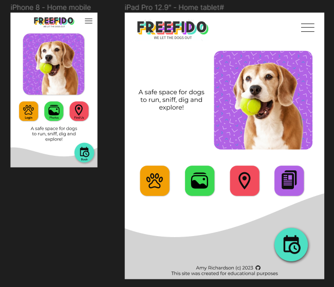  

    
Mobile/Tablet Sign Up Page
  
    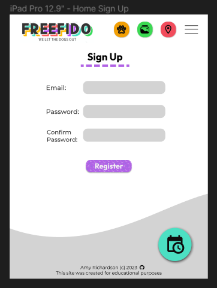

    
Mobile/Tablet Profile Page
  
    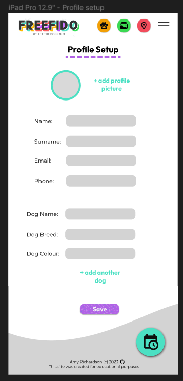

Desktop view for:

- Home
- Sign Up
- Profile
- Booking
- Gallery
- Find Us
- Contact Us

    
Desktop Home Page
  
    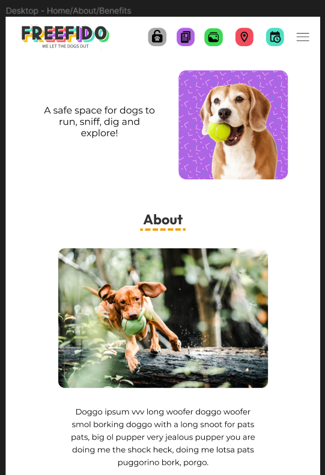  

    
Desktop Home Page Footer
  
    <ing src="documentation/wireframes/home_2_desktop.png">

    
Desktop Sign Up Page
  
    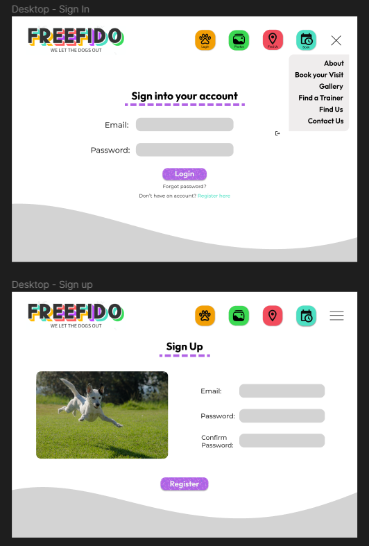

    
Desktop Profile Create Page
  
    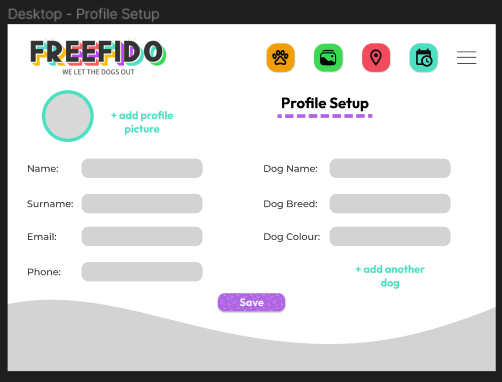

    
Desktop Profile View Page
  
    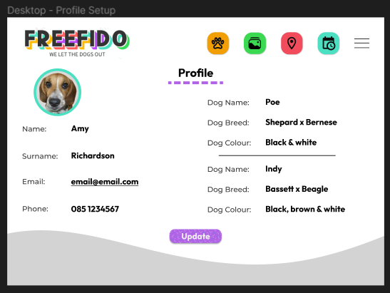 

    
Desktop Booking Page
  
    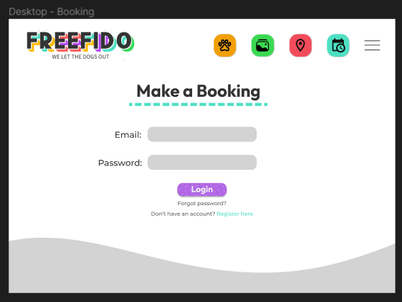

    
Desktop Booking Create Page
  
    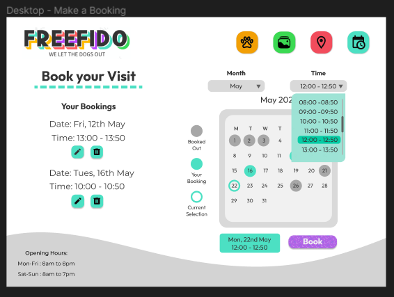  

I had grand ideas for re-creating this exact booking page in this deployment of FreeFido. However, as this was a learning/building project, my understanding of implementing packages such as Django agenda, scheduler and dj-booking reached a point after a few struggles where I felt that it was more important to follow my planning steps for MVP and deliver a basic, functional booking system first. I look forward to developing my booking sytem in the next version of FreeFido.

    
Desktop Gallery Page
  
    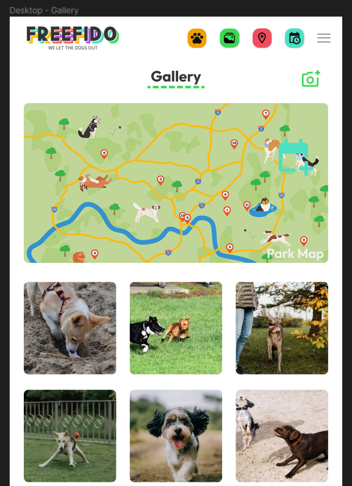

    
Desktop Gallery Add Photo Page
  
    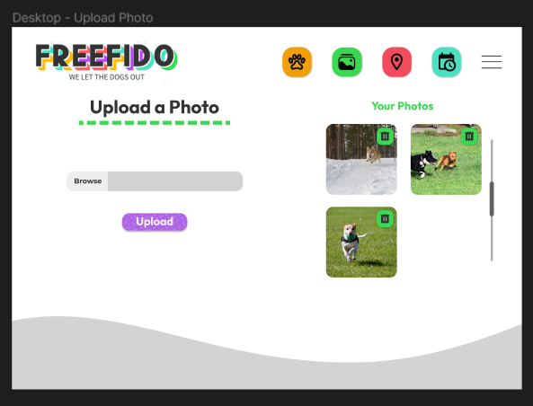

    
Desktop Find Us/Contact Us Page
  
    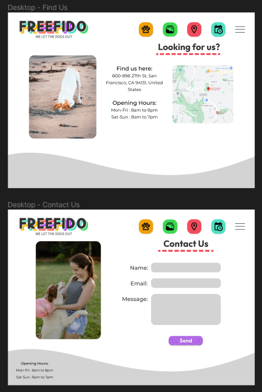  

Through the early development of FreeFido, I created an Article section to help with my learning and understanding of Django before I tackled a booking system. This feature stayed in and helped to grow the idea of having a social/educational theme to the website. There are no wireframes for my Article section but I was able to continue my modular approach to it's design by using other elements from the project's planning in it's creation.

### Database Schema

- AllAuth User Model
- ERD Diagram
- Custom Models
- Profile Model
- Booking Model

### Security

## Features

## Features

**Header & Navigation**
    - details
    - details

**Home Page**

**About Page**

**Registration**
    - Email
    - Username (unique)
    - First Name
    - Last Name
    - Password
    - Password repeat

**Login**
- It includes a small welcome back message and a link to the Registration form for users who have not yet registered for an account.
- It uses django-allauth to provide all the settings for user authentication and includes the following fields:  

  - Email
  - Password

**Logout**

**Profile**

**Relevant pages included in build........

**CRUD Booking**

**Footer**

**403, 404, 500 Pages**

These templates were added to this project in order to give the user the functionality to return to the website by using the links in the navigation bar or the Back to Homepage button at the bottom of the page.

- They are triggered when a user tries to access:
  - information that is not theirs - 403,
  - information that does not exist anymore - 404,
  - something has gone wrong with the server and cannot retrieve database - 500

**Admin Panel**
Business Owner/Django Admin Panel/Superuser

## Future Features

## Technologies Used

### Languages Used

### Libraries & Frameworks

### Tools & Programs

- [EZGif](<https://ezgif.com/>)

## Testing

- For all testing, please refer to the [TESTING.md](TESTING.md) file.

## Deployment

### Heroku deployment

### Cloudinary API

### Clone project

### Fork Project

## Credits

Django save method in models.py (<https://docs.djangoproject.com/en/4.2/ref/models/instances/>)
Django UserCreationForm | Creating New User (<https://www.javatpoint.com/django-usercreationform>)
Advanced User Profile creation using allauth/signals (<https://dev.to/thepylot/create-advanced-user-sign-up-view-in-django-step-by-step-k9m>)
Override Django's save method (<https://www.sankalpjonna.com/learn-django/how-to-override-the-save-method-in-your-django-models>)
TypeError Datetime object issue for same day bookings - (<https://bobbyhadz.com/blog/python-check-if-variable-is-datetime-object>)
                                                      - (<https://bobbyhadz.com/blog/python-typeerror-datetime-datetime-object-is-not-callable#:~:text=The%20Python%20%22TypeError%3A%20'datetime,and%20the%20built%2Din%20classes.>)

### Code

### Media

### Additional reading/tutorials/books/blogs

## Acknowledgements
