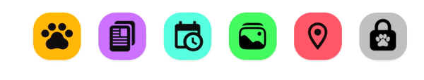
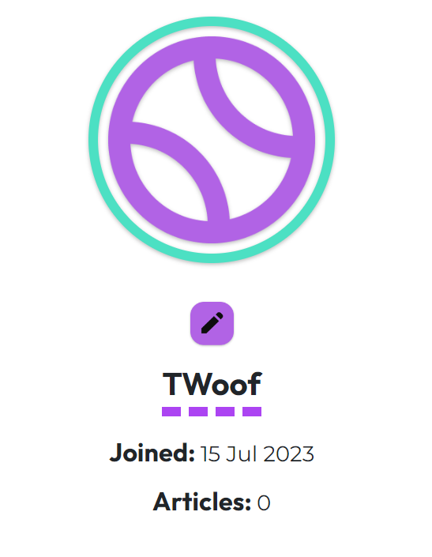
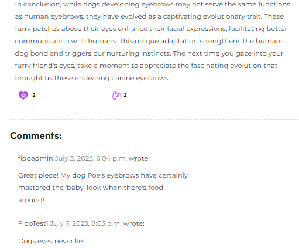
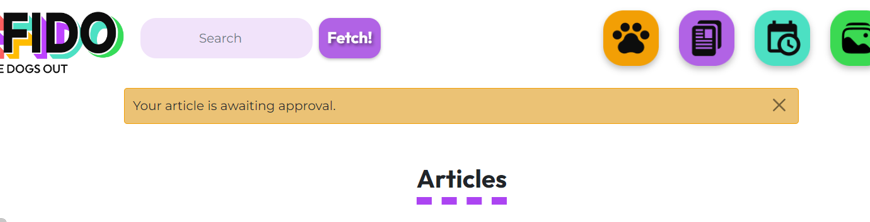
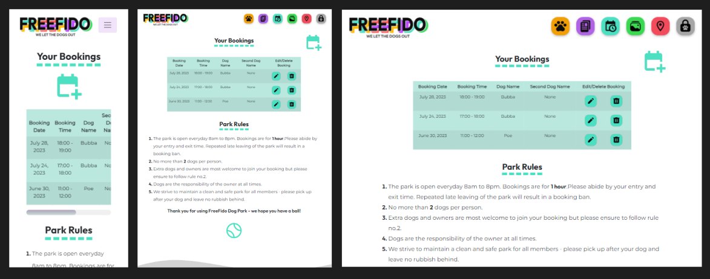
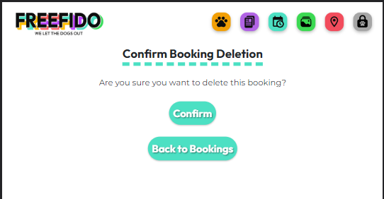
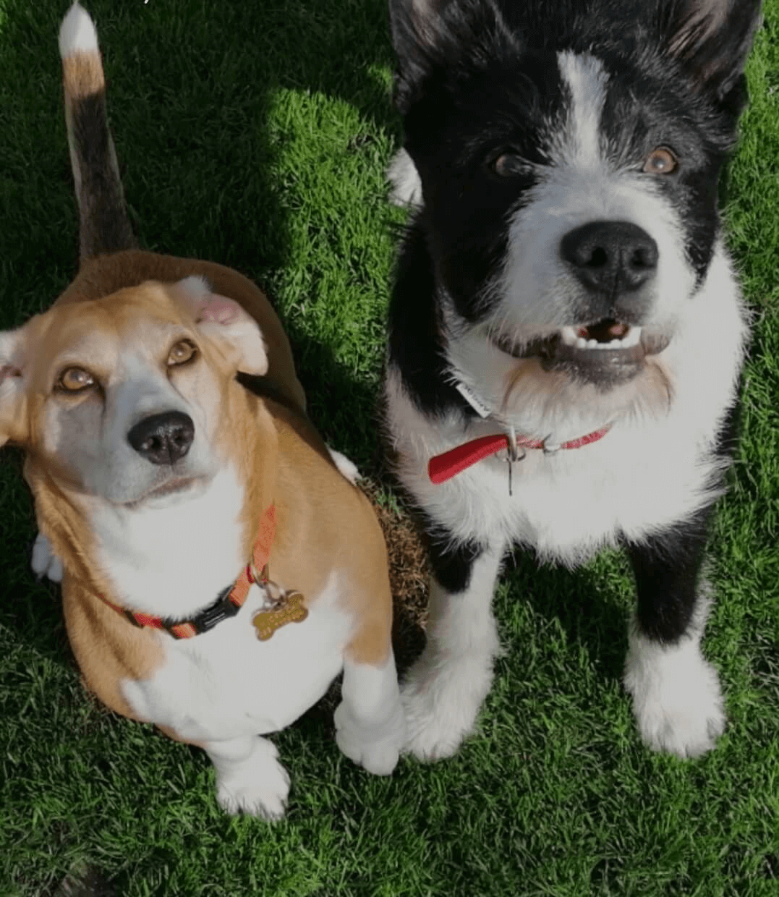

# FreeFido


## Introduction

FreeFido is a social media and booking app for a private dog park. FreeFido has been developed as part of the Code Institute's Full-Stack Developer course as my 4th project - focusing on Django and Bootstrap frameworks, Database manipulation and CRUD functionality. It is for educational purposes only.

View live site here : [FreeFido](https://freefido.herokuapp.com/)  
  
For Admin access with relevant sign-in information: [Freefido Admin](https://freefido.herokuapp.com/admin/)

<hr>

## Table of Contents

- [FreeFido](#freefido)
  - [Introduction](#introduction)
  - [Table of Contents](#table-of-contents)
  - [Overview](#overview)
- [UX - User Experience](#ux---user-experience)
  - [Design Inspiration](#design-inspiration)
    - [Colour Scheme](#colour-scheme)
    - [Font](#font)
- [Project Planning](#project-planning)
  - [Strategy Plane](#strategy-plane)
    - [Site Goals](#site-goals)
  - [Agile Methodologies - Project Management](#agile-methodologies---project-management)
    - [MoSCoW Prioritization](#moscow-prioritization)
    - [Sprints](#sprints)
  - [User Stories](#user-stories)
    - [Visitor User Stories](#visitor-user-stories)
    - [Epic - User Profile](#epic---user-profile)
    - [Epic - Articles](#epic---articles)
    - [Epic - Booking](#epic---booking)
    - [Epic - Photo Gallery](#epic---photo-gallery)
    - [Epic - Visit Us/Reviews](#epic---visit-usreviews)
  - [Scope Plane](#scope-plane)
  - [Structural Plane](#structural-plane)
  - [Skeleton \& Surface Planes](#skeleton--surface-planes)
    - [Wireframes](#wireframes)
    - [Database Schema - Entity Relationship Diagram](#database-schema---entity-relationship-diagram)
    - [Security](#security)
- [Features](#features)
  - [User View - Registered/Unregistered](#user-view---registeredunregistered)
  - [CRUD Functionality](#crud-functionality)
  - [Feature Showcase](#feature-showcase)
  - [Future Features](#future-features)
- [Technologies \& Languages Used](#technologies--languages-used)
  - [Libraries \& Frameworks](#libraries--frameworks)
  - [Tools \& Programs](#tools--programs)
- [Testing](#testing)
- [Deployment](#deployment)
  - [Connecting to GitHub](#connecting-to-github)
  - [Django Project Setup](#django-project-setup)
  - [Cloudinary API](#cloudinary-api)
  - [Elephant SQL](#elephant-sql)
  - [Heroku deployment](#heroku-deployment)
  - [Clone project](#clone-project)
  - [Fork Project](#fork-project)
- [Credits](#credits)
  - [Code](#code)
  - [Media](#media)
    - [Additional reading/tutorials/books/blogs](#additional-readingtutorialsbooksblogs)
  - [Acknowledgements](#acknowledgements)

## Overview

FreeFido is an social media and booking app for a private dog park. Users are invited to:

- Join the FreeFido community
- Create their own profiles
- Add and interact with articles
- Create and manage their bookings
- Upload their favourite snaps from the park
- Discover more about the dog park

FreeFido is accessible via all browsers with full responsiveness on different screen sizes. Its aim is to create a safe, informed community of dog owners who can interact and share with each other and avail of the essential booking feature to reserve a spot in the secure, private dog park. I have created this site to meet the needs of the growing private dog park business. Private dog parks have become a highly sought after service for dog owners to exercise and train their dogs in a safe, secure area, without the fear of a strange dog running up to them. Dog reactivity is unfortunately on the rise at public dog parks due to some dog owners being unaware of dog body language and basic etiquette. FreeFido aims to offer a starting point for creating a community of regular users of this dog park who can book one hour slots through the basic booking system. In future development of this project, I hope to offer users an upgraded booking system with payment options, the opportunity to connect with other parks users with compatible dogs via adding a friend and direct messaging. Other features will inlcude the option to hire a trainer and purchase merchandise and training equipment.


# UX - User Experience

## Design Inspiration

I was really excited to get working on this project's frontend as I could see the final product from the very beginning. I wanted to create a website that had plenty of clean whitespace that allowed colourful, bright icons to pop for each section of the website. The colours chosen were very specific from the beginning and I was careful to manipulate the CSS for each section to carry the relevant, related colour through. Original inspiration was from the Fisher-Price toy games controller, I had wanted to create an interactive, service-based website, with it's own logo using the colour scheme of the games controller. Once I had chosen the font of 'Outfit' and created the logo on Procreate, the website content followed swiftly and I had great fun developing it.

  
*Original inspiration for the design process*

  
*FreeFido logo in font 'Outfit' using colours inspired by the toy*

### Colour Scheme

As mentioned above, the colour scheme and logo drove the design of the website. I wanted to create a 'fun' environment for the user to create the connection with the enjoyment that they would have with their dog at the park. The colours represent different sections/features of the website. I balanced the vibrant shades with a classic, ```#fff``` white background and an off-black shade of ```#0d0d0d```, as I felt that it yielded a slightly more matte effect that ```#000``` black. This combination also yielded a high contrast ratio of 19.44 for accessibility, with my colour scheme also passing a Colour Blind Safe check via [Adobe Color](https://color.adobe.com/create/color-wheel). This check was important for accessibility as the colours would form the base for my page and feature icons. Each colour in the scheme was also contrast checked with black ```#0d0d0d``` to ensure no contrast issue, all passed.

The corresponding sections and colours and identifying CSS variables are:

- Authentication: ```#AC44F2``` '--purple'
- Gallery: ```#3BD952``` '--green'
- User Profile: ```#F29F05``` '--orange'
- Visiting Information: ```#F25C5C``` '--coral'
- Booking: ```#4CE0C3``` '--blue'

For the Login/Logout icon, a grey ```#a6a6a6``` was used as a base colour. I felt this grey helped to balance the colours and prevent the icons from 'popping' too much for the eye in the navigation bar.

  
*Black, white and grey used for backgrounds, text and Login/Logout icon*

  
*Colour Scheme for FreeFido website*

  
*Accessibility check for colour scheme*

### Font

Using [Google Fonts](https://fonts.google.com/), I imported 'Outfit' and 'Montserrat' as a complementary font to my CSS file. Outfit is a playful, clear sans-serif which I felt worked well in designing my logo and for headers in my project. For future use, I envisoned merchandise bearing the logo for the FreeFido stall at the dog park. Montserrat was chosen as it gave more structure to the paragraph sections.

  
*Outfit, a Google Font designed by Rodrigo Fuenzalida*

In development, 'Outfit' was identified by variable ```--title```, whilst 'Montserrat' was set as ```--main-font``` within the CSS file. Similar to my setup for the project's colours, using variables helped to speed up the frontend process.
  
# Project Planning  
 
## Strategy Plane

The project goal was to build a simple booking app for a service. The 'product' was a one hour slot in a private, secure dog park and the 'users' were dog owners, trainers and walkers. As the service itself was uncomplicated, I aimed to create an easy, uncomplicated booking system for the user. Through planning and design prep work, I realised that there was an opportunity to treat this service like a 'brand' and develop the idea further. A social element was born from this with an idea for dog owners to be able to share advice and images of their furry friends on the website. This would hopefully help to create a happy group of park users who would recommend the park to others, share articles outside of the core group, and attract more users to sign up. Following common social-media design trends, I planned to use icons, high-quality, photographic images and an attractive, connected colour scheme.

### Site Goals

- Create a safe, happy environment for dog owners
- Use of playful colour to identify connected features of the website, plenty of white space to keep it fresh and to-the-point
- Commonly-used, identifiable icons with some redesigns to fit the theme
- Easy UI for quick fulfillment of feature CRUD functionalities
- UX remains the same whether on mobile, tablet or desktop
- Scalable idea, for addition of future features to easily grow the business

## Agile Methodologies - Project Management

FreeFido is my first project following Agile planning methods. As someone who loves to prepare and plan, it was a joy to get to know and use. I used my [Github Projects Board](https://github.com/users/amylour/projects/4) to plan and document all of my work, initially I started with a [Trello](https://trello.com/) board to allow myself to make some mistakes and gather any scraps of notes or information that I had and then refined them into my Projects board. I'm sure the next time around will be a smoother process.

### MoSCoW Prioritization

I chose to follow the MoSCoW Prioritization method for Freefido, identifying and labelling my:

- **Must Haves**: the 'required', critical components of the project. Completing my 'Must Haves' helped me to reach the MVP (Minimum Viable Product) for this project early, allowing me to develop the project further than originally planned.
  
- **Should Haves**: the components that are valuable to the project but not absolutely 'vital' at the MVP stage. The 'Must Haves' must receive priority over the 'Should Haves'.
- **Could Haves**: these are the features that are a 'bonus' to the project, it would be nice to have them in this phase, but only if the most important issues have been completed first and time allows.
- **Won't Haves**: the features or components that either no longer fit the project's brief or are of very low priority for this release. 

### Sprints

I broke down the time available to me before project submission and pushed to have the MVP completed a month out from the submission date of 17th July 2023. This was primarily due to family duties and wanting to have the bulk of the project completed before my son's school finished for summer. It was a busy time frame and I reached MVP status ahead of schedule, allowing me to push my learning and add some extra features. Initially I had started FreeFido (v1) in a separate repo and I was utilising my simultaneous learning of Tailwind to great success, until I ran into issues with my database. This was to be expected on my first project using database schemas and Django. I understood what my issues were and even after flushing the database successfully, I felt that time allowed to start afresh. This version of Freefido was set up much quicker, I had more confidence in understanding the process and I chose to stick with Bootstrap this time around to concentrate on reaching MVP. 

I broke my process into Dev (Developer) Tasks, User Stories and Testing Tasks, which I converted into issues and labelled fully on my projects board. I found adding comments to my issues helpful, as I could quickly record information/sources/fixes for developing later in my README.

My Sprints are representative of a general timeframe of focus on the stated areas, with study, project work and running a household, some sprints timeframes blended with each other as work was completed during every available free moment.

| Sprint No. | Sprint Content | Start/Finish Dates |
|------------|----------------|--------------------|
| #1 | Project Setup | 23/05/23 -> 25/05/23 |
| #2 | All Auth Setup/Site Navigation | 25/05/23 -> 01/06/23 |
| #3 | Profile/Articles Features | 27/05/23 -> 06/06/23 |
| #4 | Booking/Gallery Features | 07/06/23 -> 12/06/23 |
| #5 | Frontend Development | 13/06/23 -> 20/06/23 |
| #6 | Testing/Documentation | 04/07/23 -> 14/07/23 |


## User Stories

User stories and features recorded and managed on [GitHub Projects](<https://github.com/users/amylour/projects/4>)


### Visitor User Stories

| User Story | Priority |
|----------------------------------------------------------------------------------------------------------------------------|---------------|
| As a **user**, I would like to **view the websites home page** so that I can **learn about it and the services it offers** | **MUST HAVE** |
| As a **user**, I can **find the websites navigation area** so that I **may easily navigate around the website** | **MUST HAVE** |
| As a **user**, I can **see the sites social media links at the bottom of the webpage** so that I can **visit, contact the business and follow them online** | **MUST HAVE** |
| As a **user**, I can **view any error pages with a 'Home' button** so that I **can get back to the homepage easily** | **MUST HAVE** |
| As a **user**, I want **to see a message when I have successfully/unsuccessfully completed an action** so that I can **receive feedback from my interaction with the website** | **MUST HAVE** |

### Epic - User Profile

| User Story | Priority |
|----------------------------------------------------------------------------------------------------------------------------|---------------|    
| As a **user**, I can **use my email and password to login to my profile account** so that I can **use my profile to connect to the websites features** | **MUST HAVE** |
| As a **user**, I can **enter my email and password** so that I can **register an account with the website** | **MUST HAVE** |
| As a **user**, I can **enter my personal details** so that I can **create an account with FreeFido** | **MUST HAVE** |
| As a **user**, I can **receive feedback in the form of a logout page** so that **I can confirm that I have been logged out successfully** | **MUST HAVE** |
| As a **user**, I can **edit my user profile** to **update my personal details** | **MUST HAVE** |
| As a **user**, I can **click a delete button in my user profile setup** so that I **can delete all personal data, photos and bookings that are connected to me on the website** | **COULD HAVE** |

### Epic - Articles

| User Story | Priority |
|----------------------------------------------------------------------------------------------------------------------------|---------------|
| As an **user**, I want to be able to **create and view articles** so that I can **learn more about dog related topics** | **MUST HAVE** |
| As a **user**, I would like to **move to the next page** so that I can **view all of the articles** | **SHOULD HAVE** |
| As a **user**, I would like to **view an article's likes** so that I can **find the most interesting articles** | **COULD HAVE** |
| As a **user**, I can **visit the articles page** so that I **can read and interact with the articles** | **MUST HAVE** |
| As a **user**, I can **click on an article** so that I **can view it's contents** | **MUST HAVE** |
| As a **user**, I can **click a button icon** so that I **can like/unlike and article** | **COULD HAVE** |
| As a **user**, I can **comment on a post** so that I can **interact and get involved with the conversation** | **SHOULD HAVE** |
| As a **user**, I can **fill-in, edit and save an article text field** so that I can **create and share an article from my profile** | **MUST HAVE** |
| As a **user**, I can **click on the edit button of my article** so that I can **edit the article and save it again** | **MUST HAVE** |
| As a **user**, I can **click on the delete button on my own article page** so that I can **delete the article** | **MUST HAVE** |
| As a **user**, I can **enter a search term into the search bar** so that I can **search for particular articles and articles with information topics that I am interested in** | **SHOULD HAVE** |
| As a **user**, I can **click a delete button** so that I **can remove a comment that I have made** | **COULD HAVE** |
  
### Epic - Booking

| User Story | Priority |
|----------------------------------------------------------------------------------------------------------------------------|---------------|
| As a **user**, I can **view the booking home page** so that I can **learn about booking and see my active bookings** | **MUST HAVE** |
| As a **user**, I can **use the bookings page** so that I can **make a booking at the dog park** | **MUST HAVE** |
| As a **user**, I can **receive feedback via email when I make a booking** so that I **can confirm my booking and keep a copy of it in my email account** | **COULD HAVE** |
| As a **user**, I can **edit my confirmed bookings** so that I **can choose a different day or time slot or add an extra dog** | **MUST HAVE** |
| As a **user**, I can **click the 'Trash' icon under my booking** so that I can **delete that booking from my bookings list** | **MUST HAVE** |
| As a **user**, I can **get feedback from the website** that will **explain that only four active bookings are allowed per person** | **SHOULD HAVE** |

### Epic - Photo Gallery

| User Story | Priority |
|----------------------------------------------------------------------------------------------------------------------------|---------------|
| As a **user**, I can **visit the gallery page** so that I can **view the gallery wall of photos** | **COULD HAVE** |
| As a **user**, I can **click the upload image button on the Gallery page** so that I can **upload an image of my dog having fun in the park** | **COULD HAVE** |
| As a **user**, I can **click the 'Trash' icon when I hover/click on a photo** so that I can **delete the photo** | **COULD HAVE** |

### Epic - Visit Us/Reviews

| User Story | Priority |
|----------------------------------------------------------------------------------------------------------------------------|---------------|
| As a **user**, I can **view the 'Visit Us' page** so that I can **see the businesses location and details** | **MUST HAVE** |
| As a **user**, I can **fill out a review form** so that I can **leave feedback about my park visit** | **COULD HAVE** |
| As a **user**, I can **edit my review** so that I can **correct a mistake or change my review** | **COULD HAVE** |
| As a **user**, I can **click the delete button beside my review** so that I can **delete a review that I made** | **COULD HAVE** |
    
    
## Scope Plane

As this would be a dual learning/building project using technologies that were new to me, such as Django, SQL, Bootstrap and Cloudinary, I was cautious to maintain consistent control over the scope of the project and not let my idea grow too big. With the sheer amount of files, I needed to lockdown my project features early on into manageable blocks so as not to lose track of the MVP. Following my learning of the Django MVT framework I was able to identify how to change the templated structure to produce different website features from my base HTML. This allowed me to build upon my original idea of 'Booking app' only, and to add a social experience around articles and shared images. Following Agile Planning Methodologies, I added my Developer Tasks, User Stories and Testing Tasks as issues on my [GitHub project board](https://github.com/users/amylour/projects/4), and set up Sprints to keep the flow of the project in check.

Essential features of my project were:

- A striking, accessible website that fulfils user needs
- Responsive website for users of mobile, tablet and desktop devices
- User Authentication
- User Profile creation and editing
- Article feature with full CRUD functionality
- Booking feature with full CRUD functionality
- Gallery wall with adding/deletion of images
- Business details to inform the user

Planning my project thoroughly from the start allowed me to identify areas of importance for MVP completion and satisfaction of assessment criteria, and to balance them with the feasibility of the features.


## Structural Plane

From initial concept to finished product, having icons as the navigation area was an idea that I stuck with. I wanted to understand how to implement icon-based UX successfully so that the user can easily understand its purpose. Bootstrap classes and components were used to help control the flexibility of the site alongside overriding some classes with my own CSS to style as much of the form inputs that I could. Site graphic components were created by myself in Figma and Procreate. Combining icons from Google's [Material Symbols & Icons](https://fonts.google.com/icons?icon.set=Material+Icons) pack, icons from [Flaticon](https://www.flaticon.com/) and my colour scheme, I created my navbar icons in Figma. Each icon was placed on a colour-themed rectangle with ```border-radius:30px;``` and exported as PNGs. I edited my Login/Logout icons with a pawprint in the center of lock to have them fit the dog theme better.  


  
*Navigation icons for FreeFido*

  
Accessibility is very important to me and in case I missed the mark with my icon idea, I ensured that I created tooltips for both mobile and desktop views that reveal the icons purposes on hover with the mouse and hover/light touch on mobile.  

  
  
*Navigation bar tooltips demonstrated on Desktop*

 
Continuing with a similar shape of the icons, images and buttons on the Freefido website are given a border-radius ranging from 20px - 30px to round off the corners and keep the styling consistent throughout the project.  
 
  
  
*Article card from the Articles section with rounded corner styling*

 
Headings were given thick, dashed, underline styling in the coordinating colour of their feature to mark the beginning of a section.

 
  
*Sign Up page header with purple underline for Authentication related sections*  
  

A favicon was added of a purple tennis ball to fit with the theme of the website, keeping it playful.
  

  
*Ball Favicon*
  

I utilised webkits to change the appearance of my scrollbar to include rounded endpoints and a muted, purple/teal colour-gradient. This was especially so the smaller scrollbar within the profile dashboard would fit in with the projects design. The scrollbar change was successful in the Chrome browser but did not translate over to the Mozilla or Safari browsers. This will be looked at for the next deployment to hopefully continue the design over all browsers. 
  
  
  
*Modified Scrollbar*
  

To allow for ease of responsiveness, each section was designed keeping in mind the switch from 'row' to 'column' when moving from Desktop to Mobile/Tablet view. This approach allowed me to add more features to the project early on by reusing and repurposing sections of code.

## Skeleton & Surface Planes

### Wireframes

The wireframes for FreeFido were created in Figma and were high-spec from the beginning as I was sure of my design concept. [Figma](www.figma.com) is an easy and fast design system for web and software mockups that allows for great control and testing of ideas particularly within the specific frame sizes which represent different devices. As I was using Bootstrap, I was confident that I had created a modular structure for my feature elements that would suit a grid system and that would allow them to easily work across different devices and screen sizes.

**Mobile/Tablet view for:**  

- Home
- Sign Up
- Profile

Originally I had planned for the home page to be mostly icon based for quick and easy use. However, I felt that this format would suit a downloadable app version of FreeFido, instead of the web version, which regular users might avail of to give them quicker access to the booking page, especially if they are one-handed, walking the dog on the way to the park. This will be part of my future features for the project growth.

<details open>
    <summary>Mobile/Tablet Home Page Wireframe</summary>  
      
</details>
  
The hero image of the beagle and patterned background was created in Figma. The beagle was removed from it's photo background and placed over an SVG that I edited on [Pattern Monster](https://pattern.monster/memphis-1/). The corners were then rounded.

<details>
    <summary>Mobile/Tablet Sign Up Page Wireframe</summary>  
    
</details>

<details>
    <summary>Mobile/Tablet Profile Page Wireframe</summary>  
    
</details>

**Desktop view for:**

- Home
- Sign Up
- Profile
- Booking
- Gallery
- Find Us
- Contact Us

<details open>
    <summary>Desktop Home Page Wireframe</summary>  
      
</details>

<details>
    <summary>Desktop Home Page Footer Wireframe</summary>  
    
</details>

<details>
    <summary>Desktop Sign Up Page Wireframe</summary>  
    
</details>

<details>
    <summary>Desktop Profile Create Page Wireframe</summary>  
    
</details>

<details>
    <summary>Desktop Profile View Page Wireframe</summary>  
     
</details>

<details>
    <summary>Desktop Booking Page Wireframe</summary>  
    
</details>

<details open>
    <summary>Desktop Booking Create Page Wireframe</summary>  
      
</details>

I had grand ideas for re-creating this exact booking page in this deployment of FreeFido. However, as this was a learning/building project, my understanding of implementing packages such as Django Agenda, Scheduler and dj-booking reached a point after a few struggles where I felt that it was more important to follow my planning steps for MVP and deliver a basic, functional booking system first. I look forward to developing my booking sytem in the next version of FreeFido.

<details>
    <summary>Desktop Gallery Page Wireframe</summary>  
    
</details>

<details>
    <summary>Desktop Gallery Add Photo Page Wireframe</summary>  
    
</details>

<details>
    <summary>Desktop Find Us/Contact Us Page Wireframe</summary>  
      
</details>

Through the early development of FreeFido, I created an Article section to help with my learning and understanding of Django before I tackled a booking system. This feature stayed in and helped to grow the idea of having a social/educational theme to the website. There are no wireframes for my Article section but I was able to continue my modular approach to it's design by using other elements from the project's planning in it's creation.

### Database Schema - Entity Relationship Diagram

  
*Database Schema (ERD) for FreeFido displaying relationships between feature components saved within the database*

This Entity Relationship Diagram(ERD) demonstrates how each feature interacts with each other and the connected PostgreSQL Database. Using Django's User Model, and Django AllAuth to carry out all user authentication, a user_id is created when the user registers with their username and email. This allows the user to edit a blank profile, create new articles, add comments and photos which will display their username, and create and manage their bookings. For future development, a Feedback system will be included allowing users to leave a review of the park.

The Profile, Articles and Comments Models were inspired by the blog walkthrough by the Code Institute and the [Recipe App by Daisy McGirr](https://github.com/Daisy-McG/Recipe-Tutorial) during my learning of Django. They helped me to get a good and secure grasp of the templating structure and connected Python files to push my features further, make them my own and then develop my Booking and Gallery Models.

My Booking Model collects data from the user about them and their dog(s) which can be used by the Admin to check the booking and allow entry to the park at their alloted time. The booking form displays a dropdown menu for Breed Choices and the hourly slots that are available for booking. A DateField allows that booking date to be chosen.

Through the Admin Django Dashboard, the connected user_id to all data entered to the site means that the Admin can remove a User and their data completely through the additon of on_delete=models.CASCADE. At the moment, a user can remove any data they share with the site, but they cannot delete their account completely. This feature will come in the next version.

### Security

A number of security steps were taken in this project in order to protect the user's submitted data. Unlike a strictly informative website, FreeFido allows the user to become part of the community and avail of it's booking services. To meet the strict internet standards of protecting a user's data, the following processes were included in the project's development.

**AllAuth**  

Django AllAuth is an installable framework that takes care of the user registration and authentication process. Authentication was needed to determine when a user was registered or unregistered and it controlled what content was accessible on FreeFido. The setup of AllAuth included:

- installing it to my workspace dependencies
- adding it to my INSTALLED_APPS in my settings.py
- sourcing the AUTHENTICATION_BACKENDS from the AllAuth docs for my settings.py
- adding its URL to my projects 'urls.py'
- run database migrations to create the tables needed for AllAuth
- (For this version of FreeFido, to meet MVP, email and social accounts were not configured as part of the feedback/sign up options to the user. They will be included with the next release.)
  
**Defensive Design**  

FreeFido was developed to ensure a smooth user experience, to the best of my current learning experience with Django. 

- Input validation and error messages provide feedback to the user to guide them towards the desired outcome. 
- Unregistered users are diverted to the Sign Up page from restricted access pages. 
- Authentication processes control edit/delete icons to reveal them to the content author only. 
- Deletion of data is confirmed through an additional modal, double-checking with the user.
- Error pages are displayed with 'Take me home' buttons to help users get back on track. 
- Testing and validation of features completes the process.

**CSRF Tokens** 

CSRF (Cross-Site Request Forgery) tokens are included in every form to help authenticate the request with the server when the form is submitted. Absence of these tokens can leave a site vulnerable to attackers who may steal a users data.
  

# Features

## User View - Registered/Unregistered

It was important to me from the beginning that FreeFido be accessible to an unregistered user, in some capacitites. I wanted the website to sell the product to a new user quickly by immediately inviting them into the community through the park's information, articles and gallery sections. The following is a breakdown of the site's accessibility for registered/unregistered users:

| Feature   | Unregistered User | Registered, Logged-In User |
|-----------|-------------------|-----------------|
| Home Page | Visable           | Visable         |
| Profile   | Not Visible - 'Profile' icon only appears for registered, logged-in users | Visable and full feature interaction available |
| Articles  | Visable but not interactable via 'Likes/Comments', 'Add Article' button not visible | Visable and full feature interaction available |
| Booking   | Icon visible but redirected to Sign In page/Sign Up through link | Visable and full feature interaction available |
| Gallery   | Visable but no option to 'Add Photo' | Visable and full feature interaction available |
| Visit Us  | Visable and map interaction available | Visible and map interaction available |


## CRUD Functionality

Users are able to Create, Read, Update and Delete their shared information on FreeFido. Some features make full CRUD functionality available, whilst others present the necessary options only. Here is my CRUD breakdown for FreeFido:

| Feature | Create | Read | Update | Delete |
|---------|--------|------|--------|--------|
| Profile | Created upon registration | Yes | Yes | Full Profile deletion is currently only available to Admin upon User Account deletion, the profile dashboard clears automatically if a user removes all of their articles or bookings |
| Articles | Yes | Yes | Yes | Yes |
| Bookings | Yes | Yes | Yes | Yes |
| Gallery | Yes | Yes | No - this feature felt unneccessary as it's intention is a 'quick-sharing' of a photo, a minimal amount of information is required and users are able to delete the image if they wish | Yes |

## Feature Showcase 
  
**Header/Navigation & Footer**

*For features showcase, screenshots of the features in use were taken on Laptop/iPad Pro/iPhone 12 Pro*

<details open>
    <summary>Header & Navigation - All Users (Profile Icon only visible to Registered, Logged-In Users)</summary>  
      
</details>

  
*Registered, Logged In view with Profile Icon*  
  
As mentioned in the [Structural Plane](#structural-plane) section above, the icon navigation bar allows the user to make their way around the FreeFido site. The icons have a small amount of animation when hovered/clicked on and to reinforce the icon meaning, have tooltips on hover/touch (on mobile) that display their intention.
  
The 'header.html' has been created as a separate template and using Jinja templating language, called into the 'base.html' using ``````. The templating format and file setup took a little while to get used to when putting it together at first but felt very powerful once I became acclimatised to it. 

<details open>
    <summary>Footer - Visible to all Users</summary>  
      
</details>

The FreeFido footer has been created with a 'wave' background in grey, to complement the whitespace. The social-media icons, from [Flaticon](https://www.flaticon.com), open in a new tab when clicked. Tooltips are again used for those who may not be familiar with the icons. FreeFido does not have any active social media currently so the Facebook link only brings the user to the Facebook sign up page. Twitter, LinkedIn and GitHub bring the user to my own personal accounts connected to the production of this project.

**Home Page**

<details open>
    <summary>Home Page - Visible to all Users</summary>  
      
</details>

In the Home Page 'Hero' section, when a user is not registered they will see a 'Sign Up' button under the section text, which will bring them to the Sign Up page. When logged in, they will see 'Book Today!' which will bring them to the booking page.


**About Page**

<details>
    <summary>About Page - Visible to all Users</summary>  
      
</details>  


The 'About' section of the Home Page contains three sections of information for the user, 'About', 'Safety', 'Benefits'. These sections display paragraphs and bulleted lists of information about the park and its positive values and benefits. Within each paragraph is a colour-coded word which acts as a link to bring the user to an important section of the website.

  
*'visit' provides a link to the Visit Us page as the user reads through the park's information*

<hr>

**Registration/SignUp**

<details open>
    <summary>Sign Up Page</summary>  
      
</details>
  
Users are required to add their Email, Username and Password twice, to ensure the correct one is saved. If any field is not filled in appropriately then a display message is used to inform the user with how to procede to complete the form. The Sign up and Sign in pages are created with default templates available with the AllAuth package. These templates are combined with the power of Bootstraps Crispy Forms pack to give extra control over the forms' appearance.

**Sign In**

<details open>
    <summary>Sign In Page</summary>  
      
</details>

On successful Sign In, the user is greeted with feedback through a message which confirms sign in. The 'open padlock' Log In icon now changes to a 'closed padlock' Log Out icon that the user can click to begin the Log Out process. A 'Forgot Password' page is also re-designed from the AllAuth templates but it's full functionality is not yet activated for this version.

  
*User is given feedback if they submit incorrect details where one item is correct and the other is incorrect*  


  
*Django built in field warnings for incorrect/forgotten fields input*  


  
*Sign In message and Log In icon change*


**Sign Out**

<details open>
    <summary>Sign Out Page</summary>  
      
</details>
  
A user may choose to return to the Home page and stay logged in or leave the site, logged out.

  
*User is given feedback in message format to confirm sign out, Profile icon no longer visible in navigation bar - message disappears after 3 seconds or if user clicks 'x'*  

<hr>

**Profile**

<details open>
    <summary>Profile Page - Registered Users only</summary>  
      
</details>
  
The user profile is created upon registration and displays a placeholder image and 'Edit Profile' button to allow the user to personalise their view. With future releases this page will be accessible to other users and allow connection, currently it is only viewable to the user.
  
<details>
    <summary>Profile Page - Placeholder image for Profile</summary>  
      
</details>
  
  
**Profile Edit**

<details>
    <summary>Edit Profile Modal</summary>  
      
</details>

Modal appears over the Profile page and allows users to edit their Profile Picture, Display Name (Display Name will be required for the future features of leaving Feedback/Reviews, Adding Friends and Direct Messaging) and Bio. Using the RichTextField input field, user's have more control of the formatting of their text if they wish.

<hr>

**Articles**

<details open>
    <summary>Articles Page - Unregistered User View (mobile/tablet), Registered User View with 'Add Article' icon (desktop)</summary>  
      
</details>

<details>
    <summary>Read Article Page - Unregistered User View</summary>  
      
</details>  
  
Unregistered Users have access to all articles available on FreeFido. When registered and logged in, they may access the 'Add Article' button, 'Like/Unlike' icon and leave a comment for Admin approval. Articles created are displayed on individual 'cards' which display in rows for larger screens and columns for portrait, mobile view.

  
*Site pagination kicks in to display 6 articles per page. Arrows at the base of the article section allow users to move forward and back*  


Unregistered Users are free to read the articles and comments left on FreeFido but they cannot 'Like/Comment' them until they have signed up and logged in.

  
*A Likes and Comments counter is visible under every article. Logged-In Users can interact by clicking the heart outline to like. 'Heart outline' icon is replaced by filled Heart icon*  


  
*Likes icon is represented by an outlined heart icon. When it receives a like from the logged-in user, it becomes a filled heart icon*  
  

<details open>
    <summary>Add a Comment - Registered User View</summary>  
      
</details>

A comment box is visible to logged-in users only. Their comment is submitted for review by the Admin, once approved, the comment appears on the website.

  
*Comment is awaiting approval message displayed after comment submit*
  

<details>
    <summary>Delete Comment - Registered User View for Comment Author only</summary>  
      
</details>

For the author of the comment, when logged in, a trash icon will appear to allow them to delete the comment if they wish. 


**Create Article**

<details open>
    <summary>Create Article Page - Registered, Logged In User View</summary>  
      
</details>  
  
The user may create an article and include their own image or allow a placeholder image. Feedback is given to the user to guide them if they do not fill out the required sections appropriately. The Submit button saves the article for Admin approval. Once approved, the article will appear on the main page.  
  

<details>
    <summary>Placeholder image for Articles - credit: Pattern Monster with FreeFido purple</summary>  
      
</details>


  
*Admin approval is required for articles to keep FreeFido on topic. Feedback is provided to the user by message that the article is awaiting approval*


**Edit Article**

<details open>
    <summary>Edit Article Page - Registered, Logged In User View - Article Author View - Edit/Delete Icon</summary>  
      
</details>

<details>
    <summary>Edit Article Page - Only accessible to the Article Author</summary>  
      
</details>
  
If a user spots a typo, error or wants to add new information to their article, then they may edit the article and submit for immediate reposting. A certain amount of trust exists between Admin and the FreeFido community to hope that no inappropriate or off-topic content will be shared, which will result in an immediate deletion of the user's account by the Admin. These issues will be locked down in the future development of FreeFido to allow certain content/words to be flagged and removed by the Admin or not allow the form to be submitted in the first place. Community guidelines will also be developed.

<details>
    <summary>Edit Article Message</summary>  
      
</details>


**Delete Article**

<details>
    <summary>Delete Article Page - Only accessible to the Article Author </summary>  
      
</details>

  
*User is informed that their article has been deleted - message disappears after 3 seconds*


**Search Function**

<details open>
    <summary>Search Function - Visible on Article pages only</summary>  
      
</details>  
  
A user may search for something particular using the 'Search' field, which only appears on article related pages. If the search yields no results then the user is informed and provided with a link back to the articles.

<details>
    <summary>Search Function No Articles Found - Visible on Article pages only</summary>  
      
</details>

<hr>

**Bookings**

<details open>
    <summary>Bookings Page - Registered, logged-in Users only</summary>  
      
</details>
  
The booking system that has been created for FreeFido is a basic booking system that 'gets the job done' for the starting business. The user may create, edit and delete their bookings, they are informed if a date/time is unavailable and they see a display message if their booking is saved. For future development, the UI of this booking system will improve to make unavailable times shaded-out/hidden and the user will receive confirmation emails for all bookings saved. Only 4 bookings may be held for each user and currently this includes past bookings, which the user must delete themselves. This is to remind the user of all bookings incase they may have forgotten and not attended their booked time slot, making it unavailable for someone else. In the future booking feature, the user will receive an email informing them that they have missed a booking, the booking will be flagged with a red text message on the dashboard and the user will be reminded that repeated no-shows for bookings will have their access to bookings revoked for a period of time.

<details>
    <summary>Bookings Page - Max Bookings Reached</summary>  
      
</details>


**Booking Create**

<details open>
    <summary>Booking Create Page - Visible only to Logged-In Users</summary>  
      
</details>  
  
For creating a booking, the user is informed of the necessary fields to be filled in to secure the booking via feedback. The user may add a second dog if they wish, or leave this to another time. A dropdown selection of 'Breed Choices' is made available for quicker booking, with 'Other' included for mixed breeds. This information is important to the FreeFido staff member who maybe operating the gate for allowing entry. The dog's appearance will help them to identify and confirm the booking along with the human user information.
Date and time is selectable via a calendar widget for date and dropdown selection menu displaying the hour slots from 8am to 8pm. FreeFido is super kind and opens every single day of the year for it's community members.

  
*Warning shown to Users if they choose a date in the past, can only save a booking with a valid date/time*  
 
  
  
*If a date/time combo is unavailable then the user is informed via warning message - future version of the booking system will have shaded out portions for the unavailable dates/times to make it easier on the user*  


  
*User feedback is delivered by message once a booking has been submitted through creation or edit- message disappears after 3 seconds*


**Edit Booking**

<details>
    <summary>Edit Booking Page - Visible for Logged-In Users who have made a previous Booking</summary>  
      
</details>

**Delete Booking**

<details>
    <summary>Delete Booking Page - Visible for Logged-In Users who have made a previous Booking</summary>  
      
</details>
  
A user may delete thier booking or return to the booking page incase they clicked the delete icon in error.

  
*User feedback is delivered by message once a booking has been deleted - message dissappears after 3 seconds*

<hr>

**Gallery**

<details open>
    <summary>Gallery Page - Registered, Logged-In User View with 'Add Photo' icon, Unregistered User View without icon</summary>  
      
</details>
  
The FreeFido Gallery page allows the user and Admin to quickly upload snapshots from the park's activities to create a continuous flow of updated images. An overlay on hover/touch on mobile shows the user brief information about the photograph. The carousel of images at the top of the page shows some highlighted photos. For future development this carousel will display a collection of randomly selected images from the bulk of images availabale and stored in the Cloudinary database.    

<details>
    <summary>Gallery Page - Unregistered User view with photo info on hover(Desktop)/touch (on Mobile)</summary>  
      
</details>

**Add Photo**

<details open>
    <summary>Add Photo Page - Registered Users only</summary>  
      
</details>
  
All fields are required for the Upload Image form to be submitted and saved correctly. Feedback prompts the user if they have neglected a field.

**Delete Photo**

<details open>
    <summary>Photo Delete - Registered User View - delete icon only visible over the photos uploaded by that logged-in user. </summary>  
      
</details>

<details>
    <summary>Delete Photo Page</summary>  
      
</details>
  
If a user no longer wants their image to appear, or if they have made a mistake, thay may delete their image. Admin approval is not needed for images to be posted and future development will include community posting guidelines and a form of AI software to check the image for any unwanted content.  
   
  
*User feedback is provided by message, informing user that the photo has been deleted successfully - message disappears after 3 seconds*

<hr>

**Visit Us**

<details>
    <summary>Visit Us Page</summary>  
      
</details>
  
This page offers the user business information including opening hours and address. An embedded interactive Google Map allows the user to see FreeFido's location without leaving the site. If they require driving directions to the park, they can click on the map's 'View larger map' link to go to Google Maps in a new browser tab.

For future development, this page will hold the 'Feedback' feature for registered users to leave a review of the park. 

<hr>

**403, 404, 500 Pages**

These templates were added to this project in order to give the user the functionality to return to the website by using the links in the navigation bar or the Back to Homepage button on the Error page.


- They are triggered when a user tries to access:
  - information that is not theirs - 403,
  - information that does not exist anymore - 404,
  - something has gone wrong with the server and cannot retrieve database - 500

**Admin Panel**

Through Django's built-in Administration Panel, the Admin has full access over the data submitted to the website by registered Users. To access the Admin panel the Admin user adds '/admin/' to the end of the URL to display [https://freefido.herokuapp.com/admin/](https://freefido.herokuapp.com/admin/). A username and password is requested. For FreeFido, Admin approval is needed for articles and comments to keep the site on topic and to prevent spamming. Registered, logged-in users' have instant access to make a booking and upload images.

  
*Django Admin panel view for FreeFido Administrator - content selection menu on left hand side*  


Users articles and comments require approval by the Admin of FreeFido to keep the website content on topic. Admin can change the status of articles from 'Draft' to 'Published'.

<details>
    <summary>Dropdown menu allowing Admin to 'publish' a users article, 'Save' button must be clicked to confirm</summary>  
      
</details>  

  
<details>
    <summary>Dropdown menu allowing Admin to 'approve' a users comment, 'Go' must be clicked to confirm</summary>  
      
</details>
    

Admin can control users bookings via the Django Admin panel.  

<details>
    <summary>All bookings are made available to the Admin</summary>  
      
</details>


## Future Features

- **Admin key icon for superuser login**: A 'key' icon appears in the footer for the Admin user that brings them directly to the admin panel without having to type it in.
- **Social account login**: Allowing popular social account login to the FreeFido site will speed up the registration and booking process.
- **Updated Booking system using Django Agenda/Scheduler that shows unavailable dates and times**: I did investigate this feature, I figured a way that I believe will work but it requires more learning on my part to execute it smoothly. I reminded myself of meeting the MVP.
- **Downloable app with quicker access to booking system for regular users**: I can envison FreeFido as an app that connects multiple private dog park spaces and alot more people. This would build the community. Each location would have it's own model for booking, with a menu to allow users to choose available parks or perhaps free parks within 20km.
- **Member to member contact via DM, connecting profiles to allow for sharing bookings with compatible dogs**: Community will drive the success of FreeFido and allowing users to add compatible dogs and people to their bookings opens up the parks to group training sessions, doggie birthday parties and new friendships.
- **Merchandise section with dog training items/treats available for collection at the Freefido coffee hut at dog park entrance**: I would like to utilise the website's logo and designs to sell merchandise and grow the FreeFido brand.
- **Book a Trainer/Join training classes**: This option can be easily added to the booking system with a payment or voucher system to allow users to book a trainer or group to help with any dog training/behavioural issues.
- **Quick info about local area for visitors eg pet stores/vets/dog-friendly restaurants**: Visitors new to the area with their dogs would benefit to quick access to all relevant information to make their stay better and safer.

# Technologies & Languages Used

- HTML
- CSS
- JavaScript
- Python
- [Git](https://git-scm.com/) used for version control.
- [Github](https://www.github.com) used for online storage of codebase and Projects tool.
- [CodeAnywhere](https://app.codeanywhere.com) as an online, cloud-based IDE for development.
- [Figma](https://www.figma.com) for project design planning and wireframe creation.
- [Adobe Color](https://color.adobe.com) for colour theme creation and accessibility checkers.
- [Django](https://www.djangoproject.com/) was used as the Python framework for the site.
- [Cloudinary](https://cloudinary.com/) was used for cloud media storage of user uploaded images.
- [ElephantSQL](https://www.elephantsql.com/) was used to host the PostgreSQL database needed to collect and recall the users data.
- [Heroku](https://www.heroku.com) was used to host the FreeFido application.
- [WAVE](https://wave.webaim.org/) to evaluate the accessibility of the site.
- [Procreate](https://procreate.com/) for image creation and editing.

## Libraries & Frameworks

- Bootstrap v5.2.3
- Django v3.2.19
- Django AllAuth v0.54.0
- Django Crispy Forms v2.0
- Crispy Bootstrap5 v0.7
- Django Resized v1.0.2
- Django RichTextField v1.6.1
- Django Summernote v0.8.2
- Python Slugify v8.0.1
- Pillow v9.5
  
Further information is available in the [requirements.txt file](requirements.txt)

## Tools & Programs

- [EZGif](<https://ezgif.com/>) for gif conversion.
- [Convertio](https://convertio.co/) for file conversion to PNG, WEBP.
- [Tiny Png](https://tinypng.com/) for file size reduction.
- [Lucidchart](https://www.lucidchart.com/pages) for ERD (entity relationship diagram) creation.
- [Trello](https://www.trello.com) for intial project agile planning.
- [Perplexity AI](https://www.perplexity.ai/) for breaking down Python concepts and Django documentation into more understandable chunks.
- [Pattern Monster](https://pattern.monster/) for the hero image pattern SVG.
- [Favicon](https://favicon.io/) for converting an icon into favicon.
- [LogoAI](https://www.logoai.com/) for design inspiration using my font and colour choices.

# Testing

- For all testing, please refer to the [TESTING.md](TESTING.md) file.

# Deployment
  
## Connecting to GitHub  

To begin this project from scratch, you must first create a new GitHub repository using the [Code Institute's Template](https://github.com/Code-Institute-Org/ci-full-template). This template provides the relevant tools to get you started. To use this template:

1. Log in to [GitHub](https://github.com/) or create a new account.
2. Navigate to the above CI Full Template.
3. Click '**Use this template**' -> '**Create a new repository**'.
4. Choose a new repository name and click '**Create repository from template**'.
5. In your new repository space, click the purple CodeAnywhere (if this is your IDE of choice) button to generate a new workspace.

## Django Project Setup

1. Install Django and supporting libraries: 
   
- ```pip3 install 'django<4' gunicorn```
- ```pip3 install dj_database_url psycopg2```
- ```pip3 install dj3-cloudinary-storage```  
  
2. Once you have installed any relevant dependencies or libraries, such as the ones listed above, it is important to create a **requirements.txt** file and add all installed libraries to it with the ```pip3 freeze --local > requirements.txt``` command in the terminal.  
3. Create a new Django project in the terminal ```django-admin startproject freefido .```
4. Create a new app eg. ```python3 mangage.py startapp booking```
5. Add this to list of **INSTALLED_APPS** in **settings.py** - 'booking',
6. Create a superuser for the project to allow Admin access and enter credentials: ```python3 manage.py createsuperuser```
7. Migrate the changes with commands: ```python3 manage.py migrate```
8. An **env.py** file must be created to store all protected data such as the **DATABASE_URL** and **SECRET_KEY**. These may be called upon in your project's **settings.py** file along with your Database configurations. The **env.py** file must be added to your **gitignore** file so that your important, protected information is not pushed to public viewing on GitHub. For adding to **env.py**:

- ```import os```
- ```os.environ["DATABASE_URL"]="<copiedURLfromElephantSQL>"```
- ```os.environ["SECRET_KEY"]="my_super^secret@key"```
  
For adding to **settings.py**:

- ```import os```
- ```import dj_database_url```
- ```if os.path.exists("env.py"):```
- ```import env```
- ```SECRET_KEY = os.environ.get('SECRET_KEY')``` (actual key hidden within env.py)  

9. Replace **DATABASES** with:

```
DATABASES = {
    'default': dj_database_url.parse(os.environ.get("DATABASE_URL"))
  }
```

10. Set up the templates directory in **settings.py**:
- Under ``BASE_DIR`` enter ``TEMPLATES_DIR = os.path.join(BASE_DIR, templates)``
- Update ``TEMPLATES = 'DIRS': [TEMPLATES_DIR]`` with:

```
os.path.join(BASE_DIR, 'templates'),
os.path.join(BASE_DIR, 'templates', 'allauth')
```

- Create the media, static and templates directories in top level of project file in IDE workspace.

11. A **Procfile** must be created within the project repo for Heroku deployment with the following placed within it: ```web: gunicorn freefido.wsgi```
12. Make the necessary migrations again.

## Cloudinary API 

Cloudinary provides a cloud hosting solution for media storage. All users uploaded images in the FreeFid project are hosted here.

Set up a new account at [Cloudinary](https://cloudinary.com/) and add your Cloudinary API environment variable to your **env.py** and Heroku Config Vars.
In your project workspace: 

- Add Cloudinary libraries to INSTALLED_APPS in settings.py 
- In the order: 
```
   'cloudinary_storage',  
   'django.contrib.staticfiles',  
   'cloudinary',
```
- Add to **env.py** and link up with **settings.py**: ```os.environ["CLOUDINARY_URL"]="cloudinary://...."``` 
- Set Cloudinary as storage for media and static files in settings.py:
- ```STATIC_URL = '/static/'```
```
  STATICFILES_STORAGE = 'cloudinary_storage.storage.StaticHashedCloudinaryStorage'  
  STATICFILES_DIRS = [os.path.join(BASE_DIR, 'static'), ]  
  STATIC_ROOT = os.path.join(BASE_DIR, 'staticfiles')  
  MEDIA_URL = '/media/'  
  DEFAULT_FILE_STORAGE = 'cloudinary_storage.storage.MediaCloudinaryStorage'
```

## Elephant SQL

A new database instance can be created on [Elephant SQL](https://www.elephantsql.com/) for your project. 

- Choose a name and select the **Tiny Turtle** plan, which is free.
- Select your Region and the nearest Data Center to you. 
- From your user dashboard, retrieve the important 'postgres://....' value. Place the value within your **DATABASE_URL**  in your **env.py** file and follow the below instructions to place it in your Heroku Config Vars.


## Heroku deployment

To start the deployment process , please follow the below steps:

1. Log in to [Heroku](https://id.heroku.com/login) or create an account if you are a new user.
2. Once logged in, in the Heroku Dashboard, navigate to the '**New**' button in the top, right corner, and select '**Create New App**'.
3. Enter an app name and choose your region. Click '**Create App**'. 
4. In the Deploy tab, click on the '**Settings**', reach the '**Config Vars**' section and click on '**Reveal Config Vars**'. Here you will enter KEY:VALUE pairs for the app to run successfully. The KEY:VALUE pairs that you will need are your: 
   
   - **CLOUDINARY_URL**: **cloudinary://....** 
   - **DATABASE_URL**:**postgres://...** 
   - **DISABLE_COLLECTSTATIC** of value '1' (N.B Remove this Config Var before deployment),
   -  **PORT**:**8000**
   -  **SECRET_KEY** and value  
  
5. Add the Heroku host name into **ALLOWED_HOSTS** in your projects **settings.py file** -> ```['herokuappname', localhost, 8000 port url].```
6. Once you are sure that you have set up the required files including your requirements.txt and Procfile, you have ensured that **DEBUG=False**, save your project, add the files, commit for initial deployment and push the data to GitHub.
7. Go to the '**Deploy**' tab and choose GitHub as the Deployment method.
8. Search for the repository name, select the branch that you would like to build from, and connect it via the '**Connect**' button.
9.  Choose from '**Automatic**' or '**Manual**' deployment options, I chose the 'Manual' deployment method. Click '**Deploy Branch**'.
10. Once the waiting period for the app to build has finished, click the '**View**' link to bring you to your newly deployed site. If you receive any errors, Heroku will display a reason in the app build log for you to investigate. **DISABLE_COLLECTSTATIC**  may be removed from the Config Vars once you have saved and pushed an image within your project, as can **PORT:8000**.

## Clone project

A local clone of this repository can be made on GitHub. Please follow the below steps:

1. Navigate to GitHub and log in.
2. The [FreeFido Repository](https://github.com/amylour/FreeFido_v2) can be found at this location.
3. Above the repository file section, locate the '**Code**' button.
4. Click on this button and choose your clone method from HTTPS, SSH or GitHub CLI, copy the URL to your clipboard by clicking the '**Copy**' button.
5. Open your Git Bash Terminal.
6. Change the current working directory to the location you want the cloned directory to be made.
7. Type `git clone` and paste in the copied URL from step 4.
8. Press '**Enter**' for the local clone to be created.
9. Using the ``pip3 install -r requirements.txt`` command, the dependencies and libraries needed for FreeFido will be installed.
10. Set up your **env.py** file and from the above steps for Cloudinary and ElephantSQL, gather the Cloudinary API key and the Elephant SQL url for additon to your code.
11. Ensure that your **env.py** file is placed in your **.gitignore** file and follow the remaining steps in the above Django Project Setup section before pushing your code to GitHub.

## Fork Project

A copy of the original repository can be made through GitHub. Please follow the below steps to fork this repository:  

1. Navigate to GitHub and log in.  
2. Once logged in, navigate to this repository using this link [FreeFido Repository](https://github.com/amylour/FreeFido_v2).
3. Above the repository file section and to the top, right of the page is the '**Fork**' button, click on this to make a fork of this repository.
4. You should now have access to a forked copy of this repository in your Github account.
5. Follow the above Django Project Steps if you wish to work on the project.

# Credits

## Code

The following blogs/tutorials complemented my learning for this project, alongside the [Code Institute's](https://codeinstitute.net/ie/) Learning Content.

- [Django Docs](https://www.djangoproject.com/)
- [Bootstrap Docs](https://getbootstrap.com/docs/5.3/getting-started/introduction/)
- [Code Institute's](https://github.com/Code-Institute-Org>) Blog/Boutique Ado walkthroughs
- [Daisy McGirr's](https://www.youtube.com/@IonaFrisbee) easy to follow Django Recipe App tutorial for understanding how to use Django's MVT framework
- [Adel Codes - Youtube - Service Appointment Sys using Django](https://www.youtube.com/watch?v=HTHqEr3R_Kw&t=81s)
- [Django save method](https://docs.djangoproject.com/en/4.2/ref/models/instances/) in models.py  
- [Django UserCreationForm](https://www.javatpoint.com/django-usercreationform>) Creating New Users 
- [Advanced User Profile creation using allauth/signals](<https://dev.to/thepylot/create-advanced-user-sign-up-view-in-django-step-by-step-k9m)
- [Override Django's save method](https://www.sankalpjonna.com/learn-django/how-to-override-the-save-method-in-your-django-models)
- TypeError Datetime object issue for same day bookings - [#1](https://bobbyhadz.com/blog/python-check-if-variable-is-datetime-object)
                                                      - [#2](https://bobbyhadz.com/blog/python-typeerror-datetime-datetime-object-is-not-callable#:~:text=The%20Python%20%22TypeError%3A%20'datetime,and%20the%20built%2Din%20classes.)
- Find the [parent form element](https://www.geeksforgeeks.org/difference-between-dom-parentnode-and-parentelement-in-javascript/) of delete confirm button
- [Scrollbar styling](https://www.w3schools.com/howto/tryit.asp?filename=tryhow_css_custom_scrollbar2)
- [Browser autofill styling overrule](https://stackoverflow.com/questions/2338102/override-browser-form-filling-and-input-highlighting-with-html-css)
- [Django Docs](https://docs.djangoproject.com/en/dev/ref/contrib/admin/#django.contrib.admin.ModelAdmin.readonly_fields) to make model item readonly for search function showing deleted articles
- [Django cleaned data how to](https://overiq.com/django-1-10/django-form-basics/?utm_content=cmp-true)

## Media

The following sites were used to gather the photographic media used in FreeFido:

- [Pexels](https://www.pexels.com/)
- [Unsplash](https://unsplash.com/)
 <details>
   <summary>Credit to the following photographers</summary>
   
   - https://www.dreamstime.com/stock-photo-beagle-dog-tennis-ball-wants-to-play-image93818038 - beagle image  
   - jack russell running towards Photo by Matthias Zomer: https://www.pexels.com/photo/dog-running-on-grass-422220  
   - dogs with fence Photo by Flo Dnd: https://www.pexels.com/photo/dogs-running-together-12951462/
   - dogs run Photo by Gili  Pup: https://www.pexels.com/photo/dogs-playing-in-the-field-11178657/
   - dog on log Photo by chept cormani: https://www.pexels.com/photo/dog-with-ball-in-mouth-jumping-over-a-fallen-tree-trunk-3013467/
   - snoozer Photo by Engin Akyurt: https://www.pexels.com/photo/close-up-photography-of-short-coated-white-dog-sleeping-on-green-grass-1458421/
   - shitzu close up Photo by Damian Barczak: https://www.pexels.com/photo/close-up-shot-of-an-adorable-yorkshire-terrier-running-while-looking-at-camera-7460161/
   - corgi bichon Photo by Chris Duan: https://www.pexels.com/photo/photo-of-dogs-running-14520087/
   - dog with hat https://www.pexels.com/photo/shiba-inu-wearing-beanie-hat-4588048/
   - sheltie https://pixabay.com/tr/photos/k%C3%B6pek-shetland-koyun-evcil-hayvan-8078576/
   - beach dachshund https://www.pexels.com/@ionelceban/
   - forest dogs https://www.pexels.com/search/elina%20volk/
   - party dog https://www.pexels.com/photo/a-black-and-tan-dog-7683158/
   - frenchie https://pixabay.com/ja/photos/%E7%8A%AC-%E3%83%9C%E3%82%B9%E3%83%88%E3%83%B3%E3%83%86%E3%83%AA%E3%82%A2-%E5%8F%8B%E9%81%94-%E7%B9%81%E6%AE%96-4990023/
   - surprise doggo Photo by Karolina Grabowska: https://www.pexels.com/photo/photo-of-a-dog-running-5705625/
   - dobbie Photo by Aysun Kahraman ktem: https://www.pexels.com/photo/dog-with-stick-5938159/
   - husky zoom Photo by Kateryna Babaieva: https://www.pexels.com/photo/two-siberian-husky-running-in-snowy-park-3715581/
   - husky smile Photo by cosmindoro: <https://www.pexels.com/photo/close-up-shot-of-a-siberian-husky-7175485/>
   - french bulldog Photo by Scott Spedding: <https://www.pexels.com/photo/selective-focus-photography-of-short-coated-dog-2918094/>

 </details>

 Additional photos were added by users or from my own pets.

### Additional reading/tutorials/books/blogs

- [Python Crash Course](https://www.oreilly.com/library/view/python-crash-course/9781492071266/), Author: Eric Matthes, Publisher: No Starch Press, Year: 2019 Edition.
- [Geeks for Geeks](https://www.geeksforgeeks.org/python-programming-language/?ref=ghm) for additional Python learning.

## Acknowledgements

- Many thanks to my husband and son for their continued support and for bringing me snacks when I have spent too long at the computer.
- Thank you to my mentor Rahul Lakhanpal for his positive support, guidance and advice.
- Huge thanks to my fellow students and friends, and Code Institute's Slack community for keeping positive the energy up.
- Thanks to my dogs Poe and Indy for being the inspiration for this project, maybe someday I can make Freefido a reality!  
  
  
  