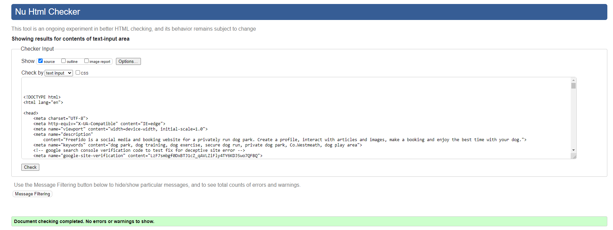
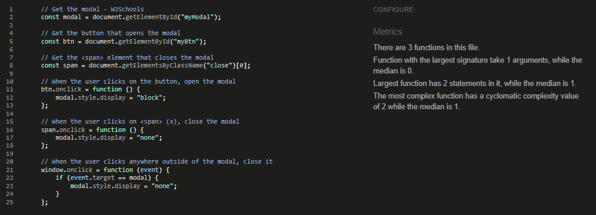
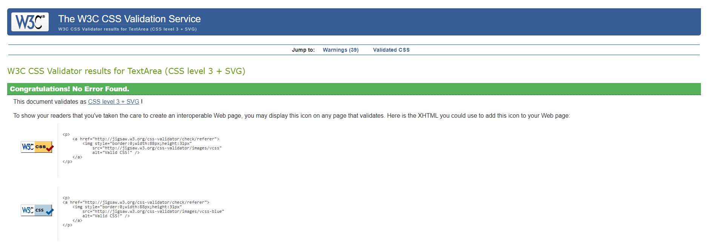
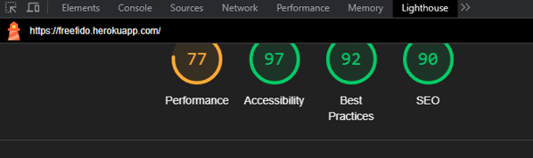
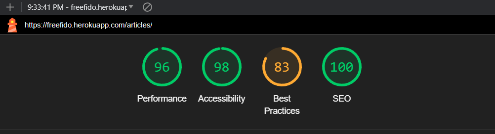
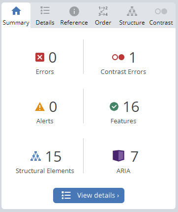

# Testing

This is the TESTING file for the [FreeFido](https://freefido.herokuapp.com/) website.

Return back to the [README.md](README.md) file.

## Testing Contents  
  
- [Testing](#testing)
  - [Testing Contents](#testing-contents)
  - [Validation](#validation)
    - [HTML Validation](#html-validation)
    - [JavaScript Validation](#javascript-validation)
    - [Python Validation](#python-validation)
    - [CSS Validation](#css-validation)
    - [Lighthouse Scores](#lighthouse-scores)
    - [Wave Accessibility Evaluation](#wave-accessibility-evaluation)
  - [User Input/Form Validation](#user-inputform-validation)
    - [Browser Compatibility](#browser-compatibility)
  - [Manual Testing](#manual-testing)
    - [Testing User Stories](#testing-user-stories)
    - [Dev Tools/Real World Device Testing](#dev-toolsreal-world-device-testing)
  - [Bugs](#bugs)
    - [Known Bugs](#known-bugs)

## Validation

### HTML Validation

For my HTML files I have used [HTML W3C Validator](https://validator.w3.org) to validate all of my HTML files.

I have had to follow a different approach for validating my HTML for this project as the majority of my pages are developed using Jinja syntax such as '' and '{{ form|crispy }}' and most require user authentication. The HTML validator will throw errors if I were to use my website's URL so I have had to follow the below approach for every page:

- Via the deployed Heroku app link, I have navigated to each individual page.
- Right clicking on the screen/CTRL+U/⌘+U on Mac, allows a menu to appear, giving me the option to 'View page source'.
- The complete HTML code for the deployed page will appear, allowing you to select the entire code using CTRL+A/⌘+A on Mac.
- Paste the copied code into the [validate by input](https://validator.w3.org/#validate_by_input) option.
- Check for errors and warnings, fix any issues, revalidate by following the above steps and record the results.

  

All HTML pages were validated and received a 'No errors or warning to show' result as shown above.

Initially my Profile and Article Page HTML were receiving [validator errors](documentation/testing/artview_p_error.png), [error code generated from Summernote code](documentation/testing/extra_p_tag.png) of having an extra p tag due to Summernotes rendering. I fixed this issue by replacing the p tags with divs, redeployed and checked for any styling issues. All clear on re-validation thankfully.

| HTML Source Code/Page | Errors | Warnings |
| ---- | ------ | -------- | 
| Home | 0 | 0 |
| Sign In | 0 | 0 |
| Sign Up | 0 | 0 |
| Profile | 0 | 0 |
| Edit Profile Modal | 0 | 0 |
| Articles | 0 | 0 |
| Add Article | 0 | 0 |
| View Article | 0 | 0 |
| Edit Article | 0 | 0 |
| Delete Article | 0 | 0 |
| Delete Comment | 0 | 0 |
| Booking | 0 | 0 |
| Create Booking | 0 | 0 |
| Edit Booking | 0 | 0 |
| Delete Booking| 0 | 0 |
| Gallery | 0 | 0 |
| Add Photo | 0 | 0 |
| Delete Photo Modal | 0 | 0 |
| Visit Us | 0 | 0 |
| Forgot Password | 0 | 0 |
| Error 403 | 0 | 0 |
| Error 404 | 0 | 0 |
| Error 500 | 0  | 0 |
  

  

### JavaScript Validation

[JSHint](https://jshint.com/) was used to validate the small amount JavaScript code added to the project. External JS, for Bootstrap purposes, obtained via [CDN](https://cdnjs.cloudflare.com/ajax/libs/bootstrap/5.2.3/js/bootstrap.min.js) was not validated through JSHint

| Page | Screenshot | Errors | Warnings |
| ---- | ---------- | ------ | -------- |
| base.html |  | none | none |
| gallery.html |  | none | none |
| profile.html |  | none | none |

### Python Validation

[CI Python Linter](https://pep8ci.herokuapp.com/#) was used to validate the Python files that were created or edited by myself. No issues presented and line lengths were double checked. I have included some screenshots with the results below.

| Feature | admin.py | forms.py | models.py | urls.py | views.py |
|---------|----------|----------|-----------|---------|----------|
| Articles | [no errors](documentation/testing/art_admin.png) | no errors | no errors | no errors | no errors |   
| Booking  | no errors | no errors | no errors | no errors | no errors |
| FreeFido main app | na | na | na | no errors | na |
| Gallery | no errors | no errors | no errors | no errors | no errors |
| Home | na | na | na | no errors | no errors |
| Profiles | no errors | no errors | no errors | no errors | no errors |
| Visit | na | na | na | no errors | no errors |

### CSS Validation 

[W3C CSS Validator](https://jigsaw.w3.org/css-validator/) was used to validate my CSS file. External CSS for Bootstrap, provided by [CDN](https://cdnjs.cloudflare.com/ajax/libs/bootstrap/5.2.3/css/bootstrap.min.css) was not tested. Warnings were present, these were related to my use of variables for colors and fonts in my CSS file.

  

 
   
### Lighthouse Scores

Lighthouse testing was carried out in Incognito mode to acheive the best result. Performance was lower than preferred due to the site being image heavy. Images used in the sites design were saved in webp and png format, and compressed using [tinypng](https://tinypng.com/) and [Convertio](https://www.convertio.co) to offer the best chance for a decent performance score. The CDNs used for Bootstrap were also noted in the Lighthouse report as causing issue with performance. This report will be reviewed for future development of Freefido to raise this score.

**Desktop**  

  
*Desktop Home Page*  
  
  
*Desktop Article Page*
  
**Mobile**  

 
*Mobile Home Page*  
  
 
*Mobile Article Page*
  

  

### Wave Accessibility Evaluation

  
  
Accessibility was included in every planning stage for FreeFido, through the use of the WAVE report tool I could ensure that any necessary changes were made to make the website as accessible as it could be. A minor contrast issue with a word rendered in orange for the feature theme and the absence of text in article image cards, due to their design, was noted in the report. These will be considered in the next version of FreeFido to better it's score.
  

  

## User Input/Form Validation

Testing was carried out on desktop using a Chrome browser to ensure all forms take the intended input and process the input appropriately.

| Feature                    | Tested?  | User Input Required | User Feedback Provided     | Pass/Fail | Fix |
|----------------------------|----------|---------------------|----------------------------|-----------|-----|

### Browser Compatibility

Freefido was tested on the following browsers, new users were created, old users data edited and all features were tested:

- Chrome v114.0.5735.199
- Firefox v114.0.2
- Edge v114.0.1823.79
- Safari v

| Browser | Issue | Functionality |
|---------|-------|---------------|
| FireFox | Profile Edit/Upload Image - File input 'Browse' Button centered in input field | Button works as expected |
| FireFox | Profile Dashboard - scrollbars following Mozilla styling | No issue |

## Manual Testing

### Testing User Stories

User Stories are documented in the FreeFido [GitHub Projects Board](https://github.com/users/amylour/projects/4). User Stories are numbered, with Acceptance Criteria and Tasks detailed within. Testing was carried out on Dev Tools for desktop/tablet/mobile, by creating multiple accounts for test users: FidoTest1, FidoTest2, FidoTest3 etc and following through by ensuring that the Acceptance Criteria were met. All features were tested to ensure that they provided the user with the expected output and action.

| User Story                 | Acceptance Criteria Met?  | Tested | Response     | Pass/Fail | Fix     |
|----------------------------|---------------------------|--------|--------------|-----------|---------|
| #1 - Home/About Template   | Yes                       | Yes    | No issues    | Pass      |    -    |
| #2 - Navigation            | Yes                       | Yes    | No issues    | Pass      |    -    |
| #3 - Footer                | Yes                       | Yes    | No issues    | Pass      |    -    |
| #4 - Login Page            | Yes                       | Yes    | No issues    | Pass      |    -    |
| #5 - SignUp/Register Page  | Yes                       | Yes    | No issues    | Pass      |    -    |
| #6 - Profile SetUp         | Yes                       | Yes    | No issues    | Pass      |    -    |
| #7 - Make a Booking Page   | Yes                       | Yes    | No issues    | Pass      |    -    |
| #8 - Create a Booking Page | Yes                       | Yes    | No issues    | Pass      |    -    |
| #9 - Visit Us Page         | Yes                       | Yes    | No issues    | Pass      |    -    |
| #10 - Logout Page          | Yes                       | Yes    | No issues    | Pass      |    -    |
| #11 - Booking Confirmation Email | Feature not included in this version - 'Should Have' item | | | | |
| #12 - Edit User Profile    | Yes                       | Yes    | No issues    | Pass      |    -    |
| #13 - Delete User Profile  | Feature left in backlog as currently unnecessary, User can delete individual items and Admin can delete complete account, future version will include delete account | | | | |
| #14 - Edit Booking         | Yes                       | Yes    | No issues    | Pass      |    -    |
| #15 - Delete Booking       | Yes                       | Yes    | No issues    | Pass      |    -    |
| #16 - Error Pages          | Yes                       | Yes    | No issues    | Pass      |    -    |
| #17 - Articles             | Yes                       | Yes    | No issues    | Pass      |    -    |
| #18 - Site Pagination      | Yes                       | Yes    | No issues    | Pass      |    -    |
| #19 - View Likes           | Yes                       | Yes    | No issues    | Pass      |    -    |
| #20 - View Articles        | Yes                       | Yes    | No issues    | Pass      |    -    |
| #21 - Open Article         | Yes                       | Yes    | No issues    | Pass      |    -    |
| #22 - Like/Unlike Article  | Yes                       | Yes    | No issues    | Pass      |    -    |
| #23 - Comment on a Post    | Yes                       | Yes    | No issues    | Pass      |    -    |
| #24 - Gallery Page         | Yes                       | Yes    | No issues    | Pass      |    -    |
| #24(mistake-allocated #24 twice) | Alert Messages | Yes   | No issues    | Pass      |    -    |
| #25 - Create Article       | Yes                       | Yes    | No issues    | Pass      |    -    |
| #26 - Delete Article       | Yes                       | Yes    | No issues    | Pass      |    -    |
| #27 - Edit Article         | Yes                       | Yes    | No issues    | Pass      |    -    |
| #28 - Search Function      | Yes                       | Yes    | No issues    | Pass      |    -    |
| #29 - Delete Comment       | Yes                       | Yes    | No issues    | Pass      |    -    |
| #30 - User Feedback for max Booking Allowance | Yes                       | Yes    | No issues    | Pass      |    -    |
| #31 - Upload Image to Gallery Wall | Yes                       | Yes    | No issues    | Pass      |    -    |
| #32 - Add Review           | Feature not included in this version - 'Could Have' item | | | | |
| #33 - Edit Review          | Feature not included in this version - 'Could Have' item | | | | |
| #34 - Delete Review        | Feature not included in this version - 'Could Have' item | | | | |
| #35 - Delete Photo         | Yes                       | Yes    | No issues    | Pass      |    -    |

  
### Dev Tools/Real World Device Testing

Responsiveness testing was carried out using Google Dev Tools on the devices detailed within the below table. Responsiveness was evident on all features throughout all tested devices. Occassionally I would have to refresh the page by clicking the 'FreeFido' logo as the page would load zoomed in or out on the simualted device. When refreshed and CSS checked the desired outcome was observed. I put this down to a caching issue in Chrome as this issue was not observed when testing on the available real world devices.
  

**Dev Tools Device Testing - all features tested, issues noted below**
| Device  | Feature    | Issue  | Fix  |
| ------- | ---------- | ------ |------|
| iPhone 4 | Messages | Text overlap with 'x' close button, article image squashed | Separate media query created for screens max-width: 350px to cope with iPhone4 320px screen width, message font size reduced, article image size reduced |
| iPhone12 Pro | All features | No issues | None needed |
| Samsung Galaxy A51 | All features | No issues | None needed |
| iPad Pro | All features | No issues | None needed |
   
  
**Real World Device Testing**
| Device      | Feature    | Issue  | Fix  | 
| ------------| ---------- | ------ |------|
| OPPO Reno 8 Lite |   All features    | No issues | None needed |
| iPhone XR | All features |  No issues  | None needed |
| iPhone 12  | All features | No issues | None needed |
| iPad Pro 2021 |    All features      |    No issues    |  None needed |
| Acer Aspire 3 2019 laptop | All features | No issues | None needed |

## Bugs  
  
As this was my first Django/Database project, most of the bugs that I encountered were learning and teething issues. The below bugs are bugs that I spent a longer length of time investigating or required the assistance of Tutor Support.

| No. | Bug | Solved | Fix | Solution Credit | Commit no. |
| --- | ---------------- | ---- | ------------- | -------------- | ------------|
| 1   | Slug not saving as prepopulated field with 'Title' data entered by user | Yes | Article title was not saving as slug, used slugify and added save method to forms.py to save the article title as an instance to be used as slug | [Blog Article](<https://www.sankalpjonna.com/learn-django/how-to-override-the-save-method-in-your-django-models>) | e6fb88e |
| 2   | Search function not yielding article return | Yes | Removed 'author', a Foreign Key from the search function in articles/views.py | [StackOverflow](<https://stackoverflow.com/questions/11754877/troubleshooting-related-field-has-invalid-lookup-icontains>) | 40fc3bf |
| 3   | User id/Profile pk mismatch | Yes - DB flushed | When creating the delete account function, I managed to delete profile pk without deleting the user id which left the id/pk mismatched and caused issues for any new users created. I accessed the python shell and tried to match the id/pk again and ensure that the next registered account would be successful. Unfortunately not so I flushed the db and re-created my superuser. Issue resolved and delete code function removed until function is better understood.    |  Using python shell -> [Medium](https://medium.com/@ksarthak4ever/django-models-and-shell-8c48963d83a3), [Django docs](https://docs.djangoproject.com/en/4.2/ref/django-admin/) - After discussing this issue with my facilitator, I will move User-self delete to a 'Could Have' label. The project scope does not require the ability for a user to delete their complete profile, only data, the Admin will have that option via the Django Admin panel. The User has full 'Delete/Clear' options for each item that they share so that they are no longer visible on the website. | 976b5ce |
|  4  | Update requirements.txt backports issue - Heroku wouldn't complete build due to this issue | Yes | Python version updated to a more stable version for Heroku deployment | [PyPi](https://pypi.org/project/backports.zoneinfo/), [Stackoverflow](https://stackoverflow.com/questions/71712258/error-could-not-build-wheels-for-backports-zoneinfo-which-is-required-to-insta) | d832760 |
| 5   | [Deceptive site issue](documentation/testing/deceptive_site.png) - Heroku site presenting as a 'Deceptive Site' intermittently on Chrome, Edge, FireFox, Safari | Yes | There were a couple of fixes for this issue. Firstly, on consulting with Tutor Support, Joanne assured me that since I had double checked all of my csrf tokens, forms and anchor tags that unfortunately the deceptive site issue was an occassional problem for different people and it was not an issue for assessment once I had made all of my checks. I persued the issue further and validated my site with Google using a head meta tag (<meta name="google-site-verification" content="LzF7smbgf0DxBTJ1cZ_qAVLZiFly4TY6KDJ5wo7QFBQ" />) and validation via their Google Search Console. It informed me that my site had issues with 'phising' but it could not give me the exact location. There were no issues with a deceptive site with Google after this issue yet the issue remained with other browsers. I then discovered that occassionally when clicking 'Open App' from the Heroku dashboard, it was not automatically applying 'https://' to the site address and that this was causing the issue. Typing the full URL allows browsing of the site with no issues (so far).| Credit to Joanne in Tutor Support for spotting my mistake | 43975ef |
| 6   | Wrong photo deletion - Delete icon was deleting the most recently uploaded photograph instead of the actual photo it was connected to | Yes | Typo - Developer Error, delete photo form was calling photo.pk instead of the id of the actual photo, photo.id. Delete Modal created to help call and confirm correct image | Checking code and my database schema to understand what I've done wrong, W3Schools modal for deletion [W3Schools](https://www.w3schools.com/howto/howto_css_modals.asp)  | 4baa2c5 + 994c522 |
| 7   | Profile page not displaying in deployed Heroku app due to missing profile image | Yes | Developer error with forgetting 'is not none' for displaying image placeholder and file path error with '/' | The lovely Joanne from Tutor Support helped me to spot my error. After a long day of coding I needed to take a break and rest my eyes so I wouldn't make the mistake again. | 7157472 + 723adca |
|  8  | Footer image not showing in deployed version, image is '404 not found', footer image is displayed using 'background-image: url(' ')' in CSS file | Yes - through using a different method | Footer background image added in HTML file instead, all checks were carried out for file path issues, static issues, CSS issues to understand why the 'background-image' property wouldn't render the image but from reading it is understood that there can be issues with Django and CSS properties where the image is called by URL -> source [Stackoverflow](https://stackoverflow.com/questions/39769469/the-way-to-use-background-image-in-css-files-with-django) | No credit needed for new fix as just normal CSS, will pursue understanding of working with Django, Heroku and deploying with images as values in CSS file | 4d90033 |

### Known Bugs

- An error is logged in the console for the deployed FreeFido site:
   'alert.js:21 Uncaught TypeError: Cannot read properties of null (reading 'defaultPrevented')
    at Q.close (alert.js:21:22)
    at (index):337:19'
    
From reading through the linked lines of JS, it seems that the error stems from an issue with calling 'EVENT_CLOSE', originating from the Bootstrap library. Other members of my group experienced the same error in their console. There were no issues with closing the modals in my features and their functionality. I will pursue this issue in future developments as I believe it may stem from a third-party library clash.

There are currently no other known bugs, if you find one then please do let me know :smile:
