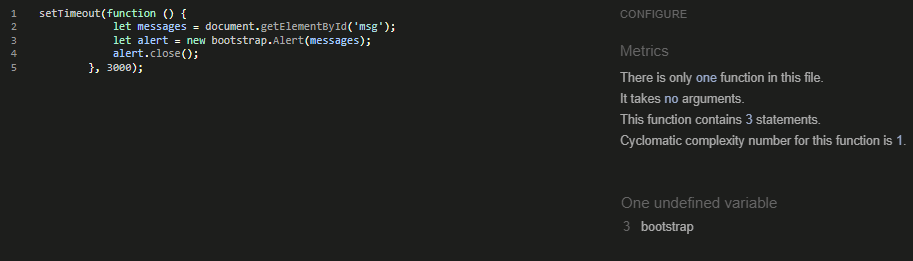

# Testing

This is the TESTING file for the [FreeFido](https://github.com/amylour/FreeFido_v2) website.

Return back to the [README.md](README.md) file.

## Testing Contents  
  
- [Testing](#testing)
  - [Testing Contents](#testing-contents)
  - [Validation](#validation)
    - [HTML Validation](#html-validation)
    - [JavaScript Validation](#javascript-validation)
    - [Python Validation](#python-validation)
    - [CSS Validation](#css-validation)
    - [Lighthouse Scores](#lighthouse-scores)
    - [Wave Accessibility Evaluation](#wave-accessibility-evaluation)
  - [User Input/Form Validation](#user-inputform-validation)
    - [Browser Compatibility](#browser-compatibility)
  - [Defensive Design](#defensive-design)
  - [Manual Testing](#manual-testing)
    - [Testing User Stories](#testing-user-stories)
    - [Dev Tools/Real World Device Testing](#dev-toolsreal-world-device-testing)
  - [Bugs](#bugs)
    - [Known Bugs](#known-bugs)

## Validation

### HTML Validation

For validation of my HTML files I have used [HTML W3C Validator](https://validator.w3.org) to validate all of my HTML files.

I have had to follow a different approach for validating my HTML for this project as the majority of my pages are developed using Jinja syntax such as '' and '{{ form|crispy }}' and most require user authentication. The HTML validator will throw errors if I were to use my website's URL so I have had to follow the below approach for every page:

- Via the deployed Heroku app link, I have navigated to each individual page.
- Right clicking on the screen/CTRL+U/⌘+U on Mac, allows a menu to appear, giving me the option to 'View page source'.
- The complete HTML code for the deployed page will appear, allowing you to select the entire code using CTRL+A/⌘+A on Mac.
- Paste the copied code into the [validate by input](https://validator.w3.org/#validate_by_input) option.
- Check for errors and warnings, fix any issues, revalidate by following the above steps and record the results.

| Page | Screenshot | Errors | Warnings |
| ---- | ---------- | ------ | -------- | 
| Home |  |   |   |
| Sign In |  |  |  |
| Sign Up |  |  |  |
| Profile |  |  |  |
| Edit Profile Modal |  |  |  |
| Articles |  |  |  |
| Add Article |  |  |  |
| View Article |  |  |  |
| Edit Article |  |  |  |
| Delete Article |  |  |  |
| Delete Comment |  |  |  |
| Booking |  |  |  |
| Create Booking |  |  |  |
| Edit Booking |  |  |  |
| Delete Booking|  |  |  |
| Gallery |  |  |  |
| Add Photo |  |  |  |
| Delete Photo Modal |  |  |  |
| Visit Us |  |  |  |
| Forgot Password |  |  |  |
| Error 400 |  |  |  |
| Error 404 |  |  |  |
| Error 500 |  |  |  |

### JavaScript Validation

[JSHint](https://jshint.com/) was used to validate the small amount JavaScript code added to the project. External JS, for Bootstrap purposes, obtained via [CDN](https://cdnjs.cloudflare.com/ajax/libs/bootstrap/5.2.3/js/bootstrap.min.js) was not validated through JSHint

| Page | Screenshot | Errors | Warnings |
| ---- | ---------- | ------ | -------- |
| base.html |  | none | none |
| gallery.html |  | none | none |
| profile.html |  | none | none |

### Python Validation

[CI Python Linter](https://pep8ci.herokuapp.com/#) was used to validate the Python files that were created or edited by myself.

| Page | Screenshot | Errors | Warnings |
| ---- | ---------- | ------ | -------- |

### CSS Validation 

[W3C CSS Validator](https://jigsaw.w3.org/css-validator/) was used to validate my CSS file. External CSS for Bootstrap, provided by [CDN](https://cdnjs.cloudflare.com/ajax/libs/bootstrap/5.2.3/css/bootstrap.min.css) was not tested.

### Lighthouse Scores

*Desktop*  

  
*Mobile*  

### Wave Accessibility Evaluation

## User Input/Form Validation

Testing was carried out on desktop using a Chrome browser to ensure all forms take the intended input and process the input appropriately.

| Feature                    | Tested?  | User Input Required | User Feedback Provided     | Pass/Fail | Fix |
|----------------------------|----------|---------------------|----------------------------|-----------|-----|

### Browser Compatibility

Freefido was tested on the following browsers:

- Chrome v
- Firefox v
- Edge v
- Safari v

| Browser | Features   | Issue  | Fix  | 
| ------- | ---------- | ------ |------|

## Defensive Design

- Security features, AllAuth, csrf tokens, error pages
- Google deceptive site issue docs/info -> https:// issue resolved

## Manual Testing

### Testing User Stories

User Stories are documented in the FreeFido [GitHub Projects Board](https://github.com/users/amylour/projects/4). User Stories are numbered, with Acceptance Criteria and Tasks detailed within. Testing was carried out on Dev Tools for desktop/tablet/mobile, by creating 2 accounts for test users: FidoTest1 and FidoTest2, and following through by ensuring that the Acceptance Criteria ware met. All features were tested to ensure that they provided the user with the expected output and action.

| User Story                 | Acceptance Criteria Met?  | Tested | Response     | Pass/Fail | Fix    |
|----------------------------|---------------------------|--------|--------------|-----------|--------|
| #1 - Home/About Template   | Yes                       | Yes    | No issues    | Pass      |        |
| #2 - Navigation            | Yes                       | Yes    | No issues    | Pass      |        |
| #3 - Footer                | Yes                       | Yes    | No issues    | Pass      |        |
| #4 - Login Page            | Yes                       | Yes    | No issues    | Pass      |        |
| #5 - SignUp/Register Page  | Yes                       | Yes    | No issues    | Pass      |        |
| #6 - Profile SetUp         | Yes                       | Yes    | No issues    | Pass      |        |
| #7 - Make a Booking Page   | Yes                       | Yes    | No issues    | Pass      |        |
| #8 - Create a Booking Page | Yes                       | Yes    | No issues    | Pass      |        |
| #9 - Visit Us Page         | Yes                       | Yes    | No issues    | Pass      |        |
| #10 - Logout Page          | Yes                       | Yes    | No issues    | Pass      |        |
| #11 - Booking Confirmation Email | Feature not included in this version - 'Should Have' item | | | | |
| #12 - Edit User Profile    | Yes                       | Yes    | No issues    | Pass      |        |
| #13 - Delete User Profile  | Feature left in backlog as currently unnecessary, User can delete individual items and Admin can delete complete account, future version will include delete account | | | | |
| #14 - Edit Booking         | Yes                       | Yes    | No issues    | Pass      |        |
| #15 - Delete Booking       | Yes                       | Yes    | No issues    | Pass      |        |
| #16 - Error Pages          | Yes                       | Yes    | No issues    | Pass      |        |
| #17 - Articles             | Yes                       | Yes    | No issues    | Pass      |        |
| #18 - Site Pagination      | Yes                       | Yes    | No issues    | Pass      |        |
| #19 - View Likes           | Yes                       | Yes    | No issues    | Pass      |        |
| #20 - View Articles        | Yes                       | Yes    | No issues    | Pass      |        |
| #21 - Open Article         | Yes                       | Yes    | No issues    | Pass      |        |
| #22 - Like/Unlike Article  | Yes                       | Yes    | No issues    | Pass      |        |
| #23 - Comment on a Post    | Yes                       | Yes    | No issues    | Pass      |        |
| #24 - Gallery Page         | Yes                       | Yes    | No issues    | Pass      |        |
| #25 - Create Article       | Yes                       | Yes    | No issues    | Pass      |        |
| #26 - Delete Article       | Yes                       | Yes    | No issues    | Pass      |        |
| #27 - Edit Article         | Yes                       | Yes    | No issues    | Pass      |        |
| #28 - Search Function      | Yes                       | Yes    | No issues    | Pass      |        |
| #29 - Delete Comment       | Yes                       | Yes    | No issues    | Pass      |        |
| #30 - User Feedback for max Booking Allowance | Yes                       | Yes    | No issues    | Pass      |        |
| #31 - Upload Image to Gallery Wall | Yes                       | Yes    | No issues    | Pass      |        |
| #32 - Add Review           | Feature not included in this version - 'Could Have' item | | | | |
| #33 - Edit Review          | Feature not included in this version - 'Could Have' item | | | | |
| #34 - Delete Review        | Feature not included in this version - 'Could Have' item | | | | |
| #35 - Delete Photo         | Yes                       | Yes    | No issues    | Pass      |        |
 

### Dev Tools/Real World Device Testing

Responsiveness testing was carried out using Google Dev Tools on the devices detailed within the below table. Responsiveness was evident on all features throughout all tested devices. Occassionally I would have to refresh the page by clicking the 'FreeFido' logo as the page would load zoomed in or out on the simualted device. When refreshed and CSS checked the desired outcome was observed. I put this down to a caching issue in Chrome as this issue was not observed when testing on the available real world devices.

*Dev Tools Device Testing*
| Device  | Feature    | Issue  | Fix  | 
| ------- | ---------- | ------ |------|
  

*Real World Device Testing*
| Device      | Feature    | Issue  | Fix  | 
| ------------| ---------- | ------ |------|
| OPPO Reno 8 Lite |       |        |      |
| iPhone XR |              |        |      |
| iPhone 12  |             |        |      |
| iPad Pro 2021 |          |        |      |
| Acer Aspire 3 2019 |     |        |      |

## Bugs

| No. | Bug | Solved | Fix | Solution Credit | Commit no. |
| --- | ---------------- | ---- | ------------- | -------------- | ------------|
| 1   |   Slug not saving as prepopulated field with 'Title' data entered by user  |    U+2713    |   <https://www.sankalpjonna.com/learn-django/how-to-override-the-save-method-in-your-django-models>  |   e6fb88e  |
| 2   |  Search function not yielding article return  |  U+2713  | removed 'author', a ForeighKey from the search function in articles/views.py   |   <https://stackoverflow.com/questions/11754877/troubleshooting-related-field-has-invalid-lookup-icontains>         |          |
| 3   |     |       |     |          |            |

### Known Bugs
